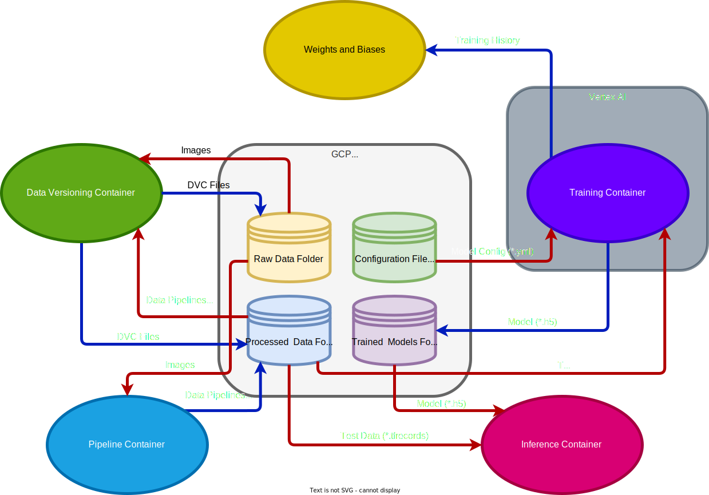
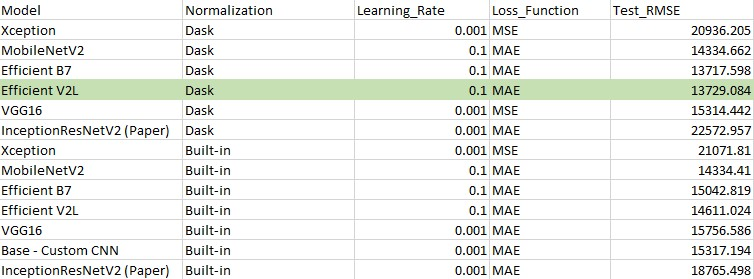

# AC215 - Milestone4 - SnapNutrition

**Team Members**
- Brent Ruttle, [brent.ruttle@gmail.com](brent.ruttle@gmail.com)
- Benjamin Fulroth, [btf355@g.harvard.edu](btf355@g.harvard.edu)
- Deepika Yeramosu, [deepikayeramosu@gmail.com](deepikayeramosu@gmail.com)
- Christina Wang, [wschristina@gmail.com](wschristina@gmail.com)
- Russell Brown, [r.n.brown314@gmail.com](r.n.brown314@gmail.com)

**Group Name**
SnapNutrition

**Project**
In this project we aim to develop an application that can estimate calories and macronutrients of food from user submitted photos of food using computer vision.

## Milestone4

### **Main Objectives for Milestone**

The main objectives for our project on this milestone:

1) Distillation/Quantization/Compression: Implement methods for model optimization such as distillation, quantization, and compression. This will enable deployment in resource-constrained environments.

2) Vertex AI Pipelines (Kubeflow) and Cloud Functions Integration: Utilize Vertex AI Pipelines (Kubeflow) for machine learning workflows and integrate cloud functions to automate and scale various processes within the project, aligning with cloud-native practices.

3) Presenting a Technical Project: Create a presentation that concisely covers what has been accomplished up to this point, and what the plan is for next steps. Here are some useful questions to think about when creating the presentation: Who is the audience (technical or non-technical), and what information can you expect them to know (and not know) going into the presentation? What’s the story that you are trying to tell? How are you planning to tell that story (e.g. slide structure, visuals, visuals, demo)? What do you want the audience to take away from the presentation?
### **Datasets**

Our main dataset is named `Nutrition 5K` where we focus on overhead images of food dishes and corresponding labels of total_calories, total_mass, total_fat, total_carb, total_protein.

### **Architecture Diagram**



### **Presentation**

Our slides for our problem, methods, and results presentation can be found [here](Group_26_Midterm_Presentation.pptx)

Note that the slide with numbers results on distillation/compression/quantization came from this [compression notebook](./notebooks/milestone_4_compression_and_sweeps/Fine_Tune_And_Compression/EfficientV2L_Model_Compression_Dask_Norm.ipynb). 
In this notebook, the displayed final summary chart has training loss, but it should be noted that the powerpoint reports validation loss in Mean Absolute Error (MAE). 
The validation losses were taken from the model printed epoch progress since we did not want to waste our low GPU credits to re-run the entire notebooks and extract this into the summary chart. 
The actual notebook was rerun for testing since the presentation, so the exact loss and validation numbers may vary in the final saved [compression notebook](./notebooks/milestone_4_compression_and_sweeps/Fine_Tune_And_Compression/EfficientV2L_Model_Compression_Dask_Norm.ipynb). 

### **Notebooks**

The [compression notebook](./notebooks/milestone_4_compression_and_sweeps/Fine_Tune_And_Compression/EfficientV2L_Model_Compression_Dask_Norm.ipynb) 
for this milestone shows how we use used our best transfer learning model EfficientV2L as the teacher model and subsequently perform:
    
- **Distillation** to Student Model
- **Pruning** of Student Distillation Model
- **Quantization with TFLite**: statically quantize only the weights from floating point to integer, which provides 8-bits of precision
- Connects to **weights and biases** for training output metrics tracking

**NOTE 1:** Hyperparameter gridsearch was initially done in separate notebooks over 6 different transfer learning model types trying combos of either Dask 
for image normalization (our dataset mean and stdev), or Imagenet/Built-in model normalization. 
The gridsearch was done using WANDB Sweeps functions.  

**NOTE 2:** There were a few more transfer learning model types tried but with our model-trainer container and not sweeps.

#### Transfer Model Sweeps Overall Results 


**Description:** There are 12 (+1 base CNN) total transfer learning model Sweep notebooks with 6 transfer model types in [dask normalized sweeps folder](./notebooks/milestone_4_compression_and_sweeps/Transfer_Learning_w_Dask_Norm) 
and the same 6 types in [built-in normalization folder](./notebooks/milestone_4_compression_and_sweeps/Transfer_Learning_w_Builtin_Normalization), 
corresponding to the respective dask or no dask image normalizations.

**Discussion Comments:** Efficient B7 was technically the best overall but has some strange calorie output issues (very off estimates despite low RMSE)
so Efficient V2L which was a close second was chosen instead. Our theory is that since MAE and MSE are calculated across all values in the macros+mass label, 
maybe some models are, for example, optimizing more for predicting mass at the expense of calories. This also made us consider whether we should have separate models
to predict each of the 5 respective macros. We plan to investigate further in later milestones.

**NOTE:** 
- Additionally, the sweeps and models were all added into **Vertex AI training job containers** see [model-sweeps container README](model-sweeps/README.md)
- **Fine-tuning** options for all transfer model types were also added to [model-training container](model-training/README.md)

**Other References:**
- All project Jupyter notebooks and dataset EDA [here](./notebooks)
- Weights and Biases product page [here](https://wandb.ai/site)
- Vertex AI product page [here](https://cloud.google.com/vertex-ai?hl=en)

### **Containers**

We built the following containers for our project:

1) [Data Versioning Control](./data_versioning_control)
2) [Data Labels Processing and Train, Test, Validation Split](./data_labels_processing)
3) [TFRecords Creation](./tfrecords_creation)
4) [Model Training](./model-training)
5) [Model Sweeps](./model-sweeps)
6) [App Frontend Container:](./src/app) Note that this container will be used later in our project.
7) [Image Processing](./src/image_prep) Note: Multiple processing options including data augmentation.

**Data Version Control Container**
 - We use an open source tool called DVC (product page [here](https://dvc.org/doc)) for versioning our datasets stored in Google Cloud Bucket
 - We mainly track our raw images and corresponding labels, as well as our generated TFRecords.
 -  This container is meant to run in a Google Cloud VM and reads from our Google Cloud Storage Bucket.
 - [Full Details Here: data versioning control README.md](./data_versioning_control/README.md)

**Data Labels Processing and Train, Test, Validation Split**

 - As input, it reads the raw image and label data, and saves the formatted filepaths + labels as pickle files into the Bucket.
 - These pickle files are already split into train, test, and validation splits for ingestion by the TFRecords container
 -  This container is meant to run in a Google Cloud VM and reads from our Google Cloud Storage Bucket.
 - [Full Details Here: data labels processing README.md](./data_labels_processing/README.md)

**TFRecords Creation Container**
 - This container is expected to read the output of the **Data Labels Processing and Train, Test, Validation Split** container. 
 - It reads the train, test, validation splits pickle files, and subsequently creates TFRecords
 - This step includes some image preprocessing, re-sizing, etc. before saving the TFRecords into the Bucket. 
 - This container also uses **Dask** to compute dataset metrics and preprocess images with dask normalizations before saving as TFRecords.
 - These TFRecords are prepped for consumption either by our Google Colab notebooks or by our **Model Training Container** and **Model Sweeps Container**
 -  This container is meant to run in a Google Cloud VM and reads from our Google Cloud Storage Bucket.
 - [Full Details Here: TFRecords Creation README.md](./tfrecords_creation/README.md)

**Model Training Container**

- This contains the code necessary to package our training script, execute a job in Vertex AI, and track model progress in Weights and Biases.
- A variety of complex architectures and transfer learning base models can be selected in the config yaml.
- Fine-tuning option flag and multi-GPU training options were also added.
- The scripts also make use of TF Records and TF Data pipelines for faster data preprocessing. See the `task.py` script to understand how we've implemented these features
- The `README.md` in this container gives detailed instructions on how to build the container, package the training scripts, and execute the packages in Vertex AI.
- The current configuration of this container allows us to manipulate a YAML file called `model_config.yml` to more easily change hyperparameters.
- [Full Details Here: model-training README.md](./model-training/README.md)

**Model Sweeps Container**

- This contains the code necessary to package our model sweep training script, execute a job in Vertex AI, and track model progress in Weights and Biases.
- A Sweep is a Weights and Biases equivalent of GridSearch where you can iterate over different combinations of parameters for model training. 
- Each Sweep gives different run id's to each training combo and groups these for tracking in Weights and Biases.
- A variety of complex architectures and transfer learning base models can be selected in the config yaml.
- The scripts also make use of TF Records and TF Data pipelines for faster data preprocessing. See the `task.py` script to understand how we've implemented these features
- [Full Details Here: model-sweeps README.md](./model-sweeps/README.md)

**Model Deployment Container**

- This container contains the code necessary to select a model saved in Weights and Biases and run inference on select images.
- The purpose is as follows: 
     1. Download best model from Weights and Biases.
     2. Change the models signature so that images that are feed into the model during inference are preprocessed.
     3. Upload the model to Vertex AI Model Registry.
     4. Deploy the model to Vertex AI and create an endpoint for prediction requests.
- [Full Details Here: model-deployment README.md](./model-deployment/README.md)

**App Front-End Container**

 - This contains the frontend app that runs in your browser.
 - The frontend is made using Flask and allows user to submit their own food photos and see the model-estimated nutrition info.
 - Visit [here](./src/app) for container directory

**Image Processing Container**

 - This container has code that allows you to define data preprocessing pipelines with Luigi 
 - You can build batches to increase the size of your image datasets and make them more robust to variations in image quality. 
 - **Note:** Augmented image data is not currently used in our training at this time. 
 - [Full Details Here: Image Processing Containers README.md](./src/image_prep/README.md)

### **Additional Architectural Explorations**

We explored several reccomended tools and structures from our AC215 course and are currently ideating on use-cases. 
Currently, we do not have a use-case in mind for our project, but that can change in future milestones. 
We have README's and demos of our efforts as follows:
- **KubeFlow**
     - See [Full Details Here: Kubeflow README.md](ml_workflow_demo/README.md)

- **Cloud Functions**
     - See [Full Details Here: Cloud Functions README.md](cloud_functions/README.md)

**Full Project Directory Structure**
<br>
```bash


```
