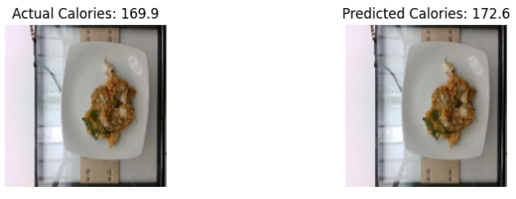
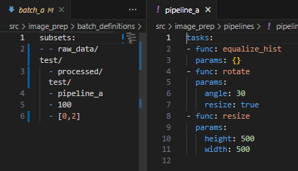
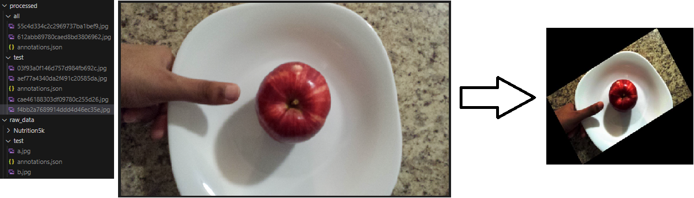

# AC215 - Milestone3 - SnapNutrition


**Block Diagram**


**Project Organization**
<br>
```
.
├── LICENSE
├── README.md
├── block_diagram.drawio.svg
├── data
│   └── raw_data
│       ├── FooDD.dvc
│       ├── Nutrition5k_Other.dvc
│       └── Nutrition5k_realsense_overhead.dvc
├── docker-compose.yml
├── model-training
│   ├── Dockerfile
│   ├── LICENSE
│   ├── Pipfile
│   ├── Pipfile.lock
│   ├── README.md
│   ├── cli-multi-gpu.sh
│   ├── cli.py
│   ├── cli.sh
│   ├── docker-entrypoint.sh
│   ├── docker-shell.bat
│   ├── docker-shell.sh
│   ├── package
│   │   ├── PKG-INFO
│   │   ├── setup.py
│   │   └── trainer
│   │       ├── __init__.py
│   │       ├── model_config.yml
│   │       ├── task.py
│   │       └── task_multi_gpu.py
│   ├── package-trainer.sh
│   ├── serverless-training.png
│   └── trainer.tar.gz
├── notebooks
│   ├── 230922_EDA_of_Nutrition5k_Ben.ipynb
│   ├── FooDD_EDA.ipynb
│   └── Nutrition5k_EDA_Base_Model.ipynb
├── reports
│   ├── base_CNN_prediction_example.jpg
│   ├── command_line.png
│   ├── vertex_ai.png
│   ├── wanb_3.png
│   ├── wandb_1.png
│   └── wandb_2.png
├── secrets
│   └── model-training.json
└── src
    ├── app
    │   ├── Dockerfile
    │   ├── Pipfile
    │   ├── Pipfile.lock
    │   ├── app.py
    │   ├── static
    │   │   ├── css
    │   │   │   ├── custom_styles.css
    │   │   │   └── styles.css
    │   │   ├── fonts
    │   │   │   ├── glyphicons-halflings-regular.eot
    │   │   │   ├── glyphicons-halflings-regular.svg
    │   │   │   ├── glyphicons-halflings-regular.ttf
    │   │   │   ├── glyphicons-halflings-regular.woff
    │   │   │   └── glyphicons-halflings-regular.woff2
    │   │   ├── img
    │   │   │   ├── 1837-diabetic-pecan-crusted-chicken-breast_JulAug20DF_clean-simple_061720 Background Removed.png
    │   │   │   ├── 1837-diabetic-pecan-crusted-chicken-breast_JulAug20DF_clean-simple_061720.jpg
    │   │   │   ├── construction_img.jpeg
    │   │   │   └── sample_upload_file_ui.png
    │   │   └── js
    │   │       ├── main.js
    │   │       └── scripts.js
    │   └── templates
    │       ├── layouts
    │       │   └── main.html
    │       └── pages
    │           ├── home.html
    │           ├── results.html
    │           ├── under_construction.html
    │           └── upload_photo.html
    ├── dvc
    │   └── Dockerfile
    └── image_prep
        ├── Dockerfile
        ├── Pipfile
        ├── Pipfile.lock
        ├── README.md
        ├── batch_definitions
        │   └── batch_a
        ├── image_prep
        │   ├── __init__.py
        │   ├── __main__.py
        │   ├── batch_builder.py
        │   ├── cli.py
        │   ├── function_registry.py
        │   ├── preprocessing_pipeline.py
        │   └── task.py
        ├── image_preprocessing_definition.png
        ├── image_preprocessing_output.png
        └── pipelines
            ├── pipeline_a
            ├── pipeline_b
            ├── pipeline_c
            ├── pipeline_d
            └── pipeline_e

```

**Team Members**
- Brent Ruttle, [brent.ruttle@gmail.com](brent.ruttle@gmail.com)
- Benjamin Fulroth, [btf355@g.harvard.edu](btf355@g.harvard.edu)
- Deepika Yeramosu, [deepikayeramosu@gmail.com](deepikayeramosu@gmail.com)
- Christina Wang, [wschristina@gmail.com](wschristina@gmail.com)
- Russell Brown, [r.n.brown314@gmail.com](r.n.brown314@gmail.com)

**Group Name**
SnapNutrition

**Project**
In this project we aim to develop an application that can estimate calories and macronutrients of food from user submitted photos of food using computer vision.

## Milestone3 

**Datasets**

We focused our efforts on the exploration and processing of two very different datasets containing images of food.

1. The first dataset named `Nutrition 5K` consists of 180GB of images and videos of food.  As this dataset is so large we narrowed our focus to only images taken directly above a plate of food.  In addition, we anticipate that this dataset will be more difficult to develop a predictive model as it consists of entire dishes with multiple foods and ingredients.  That said, we have begun initial model development and results are promising.
2. The second dataset is named `FooDD` and consists of images of single foods (apples, bread, etc.) but not all images are the same size which presents a challenge during initial preprocessing.  This challenge is being addressed in our preprocessing container below.


**Notebooks**

This folder contains code that is not part of container - for e.g: EDA, any 🔍 🕵️‍♀️ 🕵️‍♂️ crucial insights, reports or visualizations.

We had the following notebooks for Nutrition5k EDA and Modeling
1. [EDA] 230922_EDA_of_Nutrition5k_Ben.ipynb
2. [EDA + Modeling] Nutrition5k_EDA_Base_Model.ipynb

We had the following notebooks for FooDD dataset: 
1. [EDA] FooDD_EDA.ipynb

The Nutrition5k_EDA_Base_Model.ipynb colab successfully reads images from our team GCS Bucket directly for our base model.
Results from the base CNN on Nutrition5k seem promising so far. One of the best results we noticed from one sample run was: 



We look forward to more refined results with further exploration.


**Preprocess container**

- This container has code that allows you to define data preprocessing pipelines, and build batches to increase the size of your image datasets and make them more robust to variations in image quality.

(1) `src/image_prep/pipelines`
      - This contains yaml files that define preprocessing pipelines. Check src/image_prep/src/function_registry.py to see which functions are available and their parameters. A preprocessing pipeline is a series of skimage transformations and parameters
      - pipelines are referenced later in batch_definition files which are used to actually run the preprocessing

(2) `src/image_prep/batch_definitions`
      - yaml files here are used to define batches. Ex:
```
subsets:
  - "raw_data/FooDD/Apple/1-Samsung-S4-Light Environment/"
  - processed/FooDD/Apple/
  - pipeline_a
  - 100
  - false
```
      - The parameters are, input directory, output directory, pipeline name, n_images, keep_intermediates
      - n_images chooses a random sample of images, seed is specified in `src/image_prep/src/batch_builder.py`
      - keep_intermediates=true indicates that all intermediate images produced by the pipeline can end up in the batch, keep_intermediates=false indicates that only the final results should be kept
      - alternatively you can pass in a list of indexes here to keep the corresponding outputs from the pipeline

(3) To build a batch of processed images, run `docker compose run image_prep <batch_name>`

(4) For each subset in your batch definition, this will:
      - Run each image in the input folder through the preprocessing pipeline
      - Store the output from each stage in an intermediate directory, using a filename uniquely determined by the original filename and the preprocessing steps.
      - Move images from the intermediate directory to the output directory, determined by keep_intermediates and n_images. If n_images > 0, it will randomly sample up to <n_images>. If n_images=0, it will move all available images to the output directory.
      - Update or create an annotations.json file in the intermediate and output directories which maps all new filenames to their respective labels.

(5) Check the examples in the `src/image_prep/pipelines` and `src/image_prep/batch_definitions` folders for the structure of these yaml files. The ending '/' in the paths is important. This main data directory can be configured, but by default it will look for paths within a `data/` folder at the same level as the main project.

(6) Example:  This image processing pipeline definition



will produce this directory structure and images with the following transformation.



**App container**

 - This contains the frontend app that runs in your browser.
 - The frontend is made using Flask and allows user to submit their own food photos and see the model-estimated nutrition info.

**Data version control container**

 - `src/dvc` contains a Dockerfile that installs dvc and also Google Cloud CLI
 - This relies on a `secrets/data-service-account.json` file already existing that has access to the `snapnutrition_data_bucket`
 - the `secrets` folder must be on the same level as the main project, and is not tracked by Git

**Model training container**

- This contains the code necessary to package our training script, execute a job in Vertex AI, and track model progress in Weights and Biases.
- The training script currently uses a simple VGG-like model architecture for simplicity at this stage of the project. Later milestones will see usage of more complex architectures
- The scripts also make use of TF Records and TF Data pipelines for faster data preprocessing. See the `task.py` script to understand how we've implemented these features
- The `README.md` in this container gives detailed instructions on how to build the container, package the training scripts, and execute the packages in Vertex AI.
- The current configuration of this container allows us to manipulate a YAML file called `model_config.yml` to more easily change hyperparameters. Later versions will allow more control over model architectures and tracking within Weights and Biases.