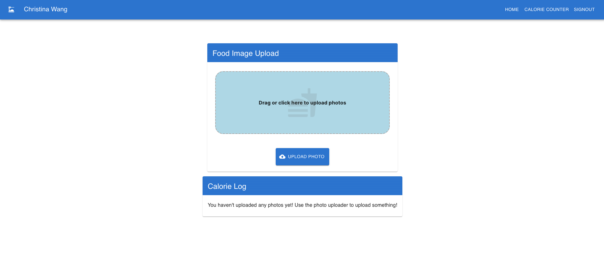
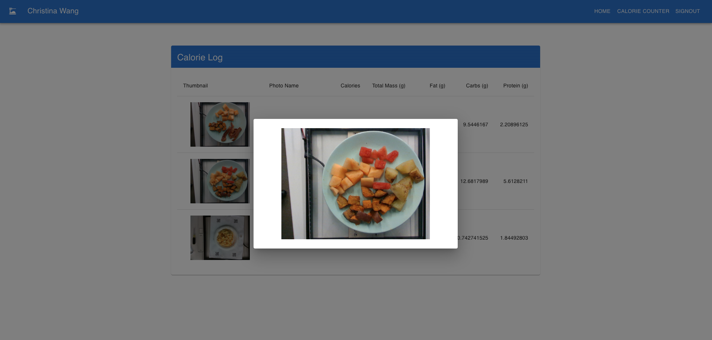

# AC215 - Milestone5 - SnapNutrition

**Team Members**
- Brent Ruttle, [brent.ruttle@gmail.com](brent.ruttle@gmail.com)
- Benjamin Fulroth, [btf355@g.harvard.edu](btf355@g.harvard.edu)
- Deepika Yeramosu, [deepikayeramosu@gmail.com](deepikayeramosu@gmail.com)
- Christina Wang, [wschristina@gmail.com](wschristina@gmail.com)
- Russell Brown, [r.n.brown314@gmail.com](r.n.brown314@gmail.com)

**Group Name**
SnapNutrition

**Project**
In this project we aim to develop an application that can estimate calories and macronutrients of food from user submitted photos of food using computer vision.

## Milestone5

### **Main Objectives for Milestone**

The main objectives for our project on this milestone:

1. App Design, Setup, and Code Organization: Design the overall architecture of the application, including its user interface, functionality, and underlying code structure. Focus on intuitive design and clean code organization to ensure maintainability and efficiency.

1. APIs & Frontend Integration: Develop robust APIs that facilitate communication between the front end and back end of the application. Implement a responsive and user-friendly front-end interface that leverages these APIs to create a seamless user experience.

1. Deployment Strategy: Utilize Ansible to create, provision, and deploy our frontend and backend to GCP in an automated fashion.

### Application Design

We built a detailed design document outlining the application’s architecture. More specifically, we built a Solution Architecture and Technical Architecture to ensure all our components work together.

#### **Solution Architecture**

*Documentation on solution arch...*

#### **Technical Architecture**

 

 *Documentation on technical arch...*

 ### Backend API

 We built backend API service using fast API to expose model functionality to the frontend.  Within this API service we built a mechanism that automatically retrieves our best model from a Google bucket. We also have the option of using a Vertex AI endpoint which may reduce inference latency. Testing is still in progress.

 

 __Example:__ api-service automatically pulling a csv file of model metrics to be use in selecting the best available model.

 

### Frontend

We started developing a user friendly frontend web app based on the React framework.  
The app is being designed with the user in mind with a simple interface for a user to select or drag and drop a 
picture of a plate of food and immediately receive and estimate of the macronutrients from our predictive model.

It uses next.js on top of React for routing, and also we setup Google Firebase Authentication for sign-in.

#### Screenshots of Successful Frontend

New user and/or not logged in

Once click log-in, you redirect here for Firebase Auth Login

Once you are logged-in, you go to the Calorie Counter tab

You can either click upload or drag files into the dropzone

You will see your results appear below the dropzone as an increasing list

If you go back to the home page, you will see recent uploads and results

You can also click on an image to get a zoomed-in view

### Deployment

We used Ansible to create, provision, and deploy our frontend and backend to GCP in an automated fashion. Ansible helps us manage infrastructure as code and this is very useful to keep track of our app infrastructure as code in GitHub. It helps use setup deployments in a very automated way.

**Example of Containers Automatically Registered in Google Container Registry using Ansible**

Ansible CLI output when deplying Docker images

Google Container Registry

**Example of Automatically Created and Provisioned VM using Ansible** 

Ansible CLI output when provisioning instance

Automatically deployed VM running

SSH into VM shows three containers running (nginx, api-service, frontend)

### **Code Structure**
#### **Containers**

We built the following containers for our project:

1) [Data Versioning Control](./data_versioning_control)
2) [Data Labels Processing and Train, Test, Validation Split](./data_labels_processing)
3) [TFRecords Creation](./tfrecords_creation)
4) [Model Training](./model-training)
5) [Model Sweeps](./model-sweeps)
6) [App Frontend Container:](./src/app) Note that this container will be used later in our project.
7) [Image Processing](./src/image_prep) Note: Multiple processing options including data augmentation.

