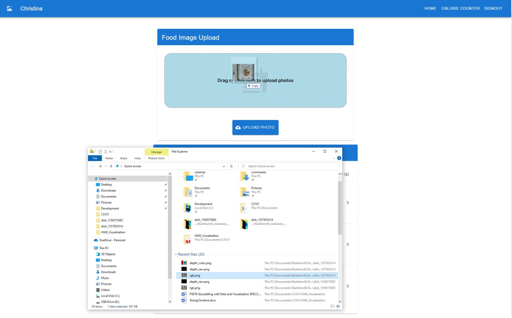
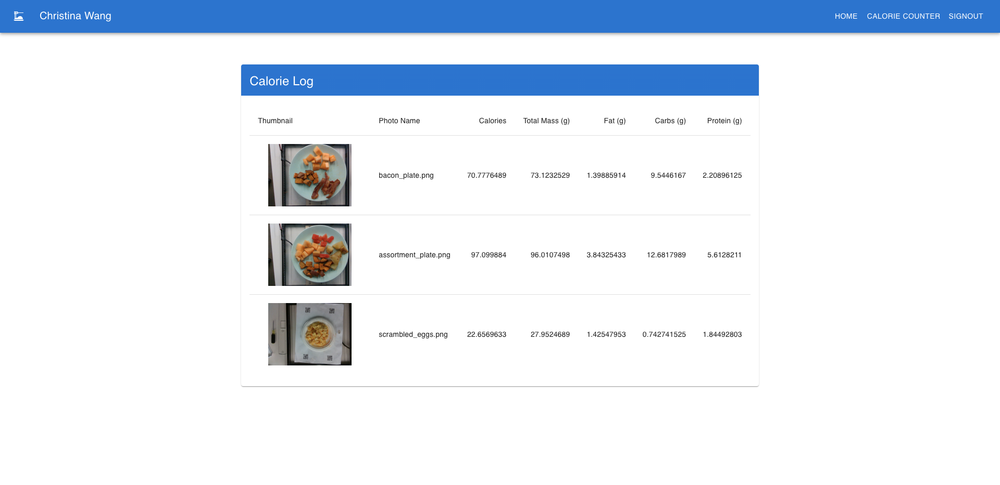
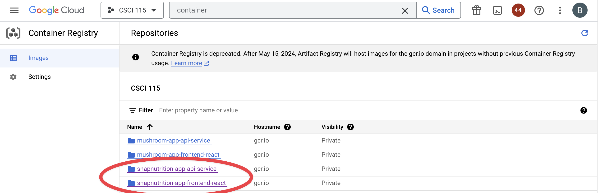

# AC215 - Milestone5 - SnapNutrition

**Team Members**
- Brent Ruttle, [brent.ruttle@gmail.com](brent.ruttle@gmail.com)
- Benjamin Fulroth, [btf355@g.harvard.edu](btf355@g.harvard.edu)
- Deepika Yeramosu, [deepikayeramosu@gmail.com](deepikayeramosu@gmail.com)
- Christina Wang, [wschristina@gmail.com](wschristina@gmail.com)
- Russell Brown, [r.n.brown314@gmail.com](r.n.brown314@gmail.com)

**Group Name**
SnapNutrition

**Project**
In this project we aim to develop an application that can estimate calories and macronutrients of food from user submitted photos of food using computer vision.

## Milestone5

### **Main Objectives for Milestone**

The main objectives for our project on this milestone:

1. App Design, Setup, and Code Organization: Design the overall architecture of the application, including its user interface, functionality, and underlying code structure. Focus on intuitive design and clean code organization to ensure maintainability and efficiency.

1. APIs & Frontend Integration: Develop robust APIs that facilitate communication between the front end and back end of the application. Implement a responsive and user-friendly front-end interface that leverages these APIs to create a seamless user experience.

1. Deployment Strategy: Utilize Ansible to create, provision, and deploy our frontend and backend to GCP in an automated fashion.

### Application Design

We built a detailed design document outlining the application’s architecture. More specifically, we built a Solution Architecture and Technical Architecture to ensure all our components work together.

#### **Solution Architecture**

Here is our overall solution architecture with our processes, executions, and states.

#### **Technical Architecture**

Here is our technical architecture. For more technical details, visit the bottom of this readme for the
containers involved and more README's.

 ### Backend API

 We built backend API service using fast API to expose model functionality to the frontend.  Within this API service we built a mechanism that automatically retrieves our best model from a Google bucket. We also have the option of using a Vertex AI endpoint which may reduce inference latency. Testing is still in progress.

 

 __Example:__ api-service automatically pulling a csv file of model metrics to be use in selecting the best available model.

 

### Frontend

We started developing a user-friendly frontend web app based on the React framework.  
The app is being designed with the user in mind with a simple interface for a user to select or drag and drop a 
picture of a plate of food and immediately receive and estimate of the macronutrients from our predictive model.

It uses next.js on top of React for routing, and also we setup Google Firebase Authentication for sign-in.

#### Screenshots of Successful Frontend

New user and/or not logged in

Once click log-in, you redirect here for Firebase Auth Login

Once you are logged-in, you go to the Calorie Counter tab

You can either click upload or drag files into the dropzone

You will see your results appear below the dropzone as an increasing list

If you go back to the home page, you will see recent uploads and results

You can also click on an image to get a zoomed-in view

### Deployment

We used Ansible to create, provision, and deploy our frontend and backend to GCP in an automated fashion. Ansible helps us manage infrastructure as code and this is very useful to keep track of our app infrastructure as code in GitHub. It helps use setup deployments in a very automated way.

**Example of Containers Automatically Registered in Google Container Registry using Ansible**

Ansible CLI output when deploying Docker images

Google Container Registry

**Example of Automatically Created and Provisioned VM using Ansible** 

Ansible CLI output when provisioning instance

Automatically deployed VM running

SSH into VM shows three containers running (nginx, api-service, frontend)

### **Code Structure**
#### **Containers**

We built the following containers for our project:

1) [Data Versioning Control](./data_versioning_control)
2) [Data Labels Processing and Train, Test, Validation Split](./data_labels_processing)
3) [TFRecords Creation](./tfrecords_creation)
4) [Model Training](./model-training)
5) [Model Sweeps](./model-sweeps)
6) [App Frontend Container:](./src/app) Note that this container will be used later in our project.
7) [Image Processing](./src/image_prep) Note: Multiple processing options including data augmentation.
8) [Frontend Container (React, Next.js, Google Firebase Auth)](./frontend)
9) [API-Service](./app/src/api-service)
10) [model-eval](./model-eval)
11) [model-deployment](./model-deployment)

**Data Version Control Container**
- We use an open source tool called DVC (product page [here](https://dvc.org/doc)) for versioning our datasets stored in Google Cloud Bucket
- We mainly track our raw images and corresponding labels, as well as our generated TFRecords.
-  This container is meant to run in a Google Cloud VM and reads from our Google Cloud Storage Bucket.
- [Full Details Here: data versioning control README.md](./data_versioning_control/README.md)

**Data Labels Processing and Train, Test, Validation Split**

- As input, it reads the raw image and label data, and saves the formatted filepaths + labels as pickle files into the Bucket.
- These pickle files are already split into train, test, and validation splits for ingestion by the TFRecords container
-  This container is meant to run in a Google Cloud VM and reads from our Google Cloud Storage Bucket.
- [Full Details Here: data labels processing README.md](./data_labels_processing/README.md)

**TFRecords Creation Container**
- This container is expected to read the output of the **Data Labels Processing and Train, Test, Validation Split** container.
- It reads the train, test, validation splits pickle files, and subsequently creates TFRecords
- This step includes some image preprocessing, re-sizing, etc. before saving the TFRecords into the Bucket.
- This container also uses **Dask** to compute dataset metrics and preprocess images with dask normalizations before saving as TFRecords.
- These TFRecords are prepped for consumption either by our Google Colab notebooks or by our **Model Training Container** and **Model Sweeps Container**
-  This container is meant to run in a Google Cloud VM and reads from our Google Cloud Storage Bucket.
- [Full Details Here: TFRecords Creation README.md](./tfrecords_creation/README.md)

**Model Training Container**

- This contains the code necessary to package our training script, execute a job in Vertex AI, and track model progress in Weights and Biases.
- A variety of complex architectures and transfer learning base models can be selected in the config yaml.
- Fine-tuning option flag and multi-GPU training options were also added.
- The scripts also make use of TF Records and TF Data pipelines for faster data preprocessing. See the `task.py` script to understand how we've implemented these features
- The `README.md` in this container gives detailed instructions on how to build the container, package the training scripts, and execute the packages in Vertex AI.
- The current configuration of this container allows us to manipulate a YAML file called `model_config.yml` to more easily change hyperparameters.
- [Full Details Here: model-training README.md](./model-training/README.md)

**Model Sweeps Container**

- This contains the code necessary to package our model sweep training script, execute a job in Vertex AI, and track model progress in Weights and Biases.
- A Sweep is a Weights and Biases equivalent of GridSearch where you can iterate over different combinations of parameters for model training.
- Each Sweep gives different run id's to each training combo and groups these for tracking in Weights and Biases.
- A variety of complex architectures and transfer learning base models can be selected in the config yaml.
- The scripts also make use of TF Records and TF Data pipelines for faster data preprocessing. See the `task.py` script to understand how we've implemented these features
- [Full Details Here: model-sweeps README.md](./model-sweeps/README.md)

**Model Deployment Container**

- This container contains the code necessary to select a model saved in Weights and Biases and run inference on select images.
- The purpose is as follows:
  1. Download best model from Weights and Biases.
  2. Change the models signature so that images that are feed into the model during inference are preprocessed.
  3. Upload the model to Vertex AI Model Registry.
  4. Deploy the model to Vertex AI and create an endpoint for prediction requests.
- [Full Details Here: model-deployment README.md](./model-deployment/README.md)

**App Front-End Container**

- This contains the frontend app that runs in your browser.
- The frontend is made using Flask and allows user to submit their own food photos and see the model-estimated nutrition info.
- Visit [here](./src/app) for container directory

**Image Processing Container**

- This container has code that allows you to define data preprocessing pipelines with Luigi
- You can build batches to increase the size of your image datasets and make them more robust to variations in image quality.
- **Note:** Augmented image data is not currently used in our training at this time.
- [Full Details Here: Image Processing Containers README.md](./src/image_prep/README.md)

**Frontend Container**
- This container runs React, Next.js, and Google Firebase Auth (for signup and login)
- It allows users to upload their food images and get predictions from our best model (Vertex AI API or downloaded locally)
- **Note:** you may see a frontend-react which was a basic frontend container used for initial testing e.g. [here](./app/src/frontend-react)
- [Full Details Here: Frontend README](./frontend/README.md)

**API Service**
- This container is our backend service for the frontend API. It either grabs predictions from Vertex endpoint or downloads
  the best model locally on start-up.
- [Full Details Here: Backend README](./app/src/api-service/README.md)

**Model Evaluation**
- This container evaluates model candidates for the best model
- It creates an evaluation summary called `experiment_results.csv`
  and stores it in the `snapnutrition_data_bucket` GCS bucket within the `model_eval` folder
- It finds the best model and store it in the `best_model` folder within the `model_eval` folder in the GCS bucket
- This will be used for which model to serve by the backend API
- [Full Details Here: Model Eval README](./model-eval/README.md)

**Model Deployment**
- Downloads best model from Weights and Biases.
- Change the models signature so that images that are feed into the model during inference are preprocessed.
- Uploads the model to Vertex AI Model Registry.
- Deploy the model to Vertex AI and create an endpoint for prediction requests.
- This is also utilized as another option by the backend API
- [Full Details Here](./model-deployment/README.md)

### Previous Milestones Structure (Not Including Containers for Final Application, But Model Training)

### **Additional Architectural Explorations (Previous Milestones)**

We explored several recommended tools and structures from our AC215 course and are currently ideating on use-cases.
Currently, we do not have a use-case in mind for our project, but that can change in future milestones.
We have README's and demos of our efforts as follows:
- **KubeFlow**
  - See [Full Details Here: Kubeflow README.md](ml_workflow_demo/README.md)

- **Cloud Functions**
  - See [Full Details Here: Cloud Functions README.md](cloud_functions/README.md)