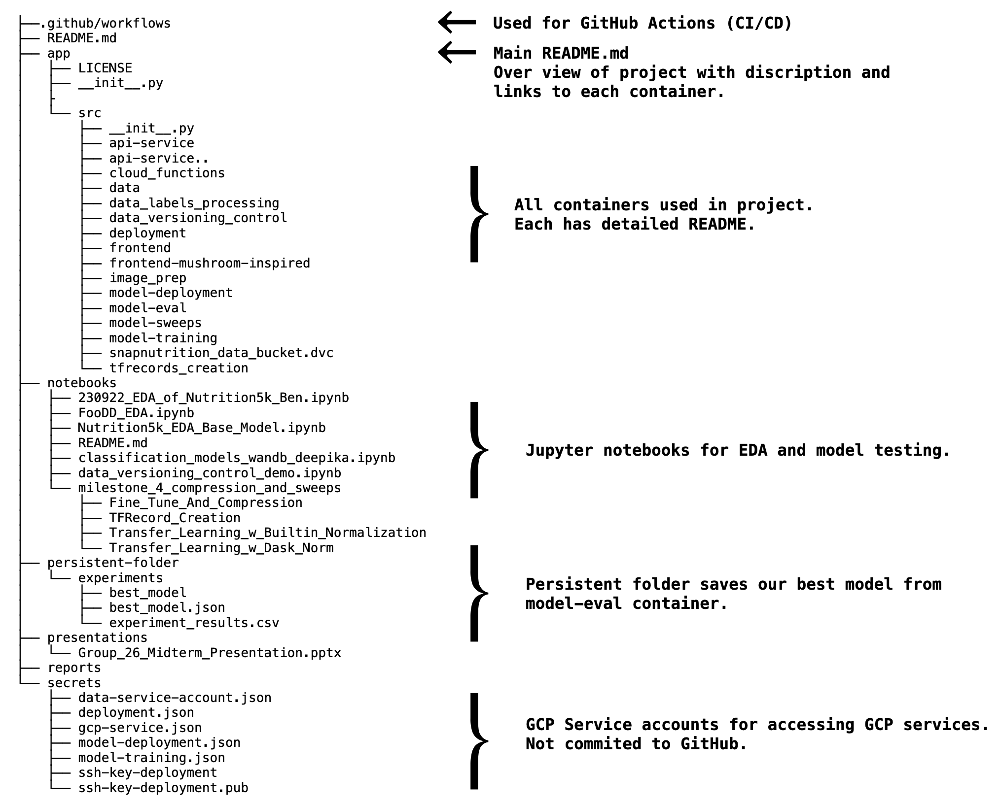
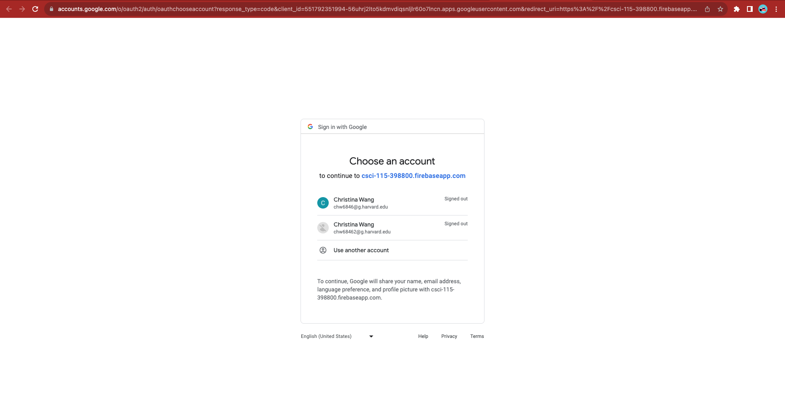

# AC215 - SnapNutrition
==============================

**Team Members**
- Brent Ruttle, [brent.ruttle@gmail.com](brent.ruttle@gmail.com)
- Benjamin Fulroth, [btf355@g.harvard.edu](btf355@g.harvard.edu)
- Deepika Yeramosu, [deepikayeramosu@gmail.com](deepikayeramosu@gmail.com)
- Christina Wang, [wschristina@gmail.com](wschristina@gmail.com)
- Russell Brown, [r.n.brown314@gmail.com](r.n.brown314@gmail.com)

### Presentation  Video
* [Youtube Presentation](https://youtu.be/7q6euZdu2UE)

### Blog Post Link
*  [Medium Post](https://medium.com/@wschristina/snapnutrition-bridging-the-gap-between-technology-and-dietary-well-being-dbd6fc5ffc1c)
---

### Project Organization




# AC215 - Final Project

**Group Name:** SnapNutrition

**Project - Problem Definition**<br>
In this project we aim to develop an application that can estimate calories and macronutrients of food from user submitted photos of food using computer vision.

## Data Description

We conducted a thorough review of literature, open-source projects, and datasets. The dataset that we decided as team to use for this project was published by a Google Research Group and called [Nutrition 5K](https://github.com/google-research-datasets/Nutrition5k).  The paper accompanying the dataset describes a their systematic approach to capturing and curating images, depth images, and video of entire plates of food from two cafeterias for the purpose of model training. In addition, the original dataset was composed of 180 GB, most of which was video.  As video and depth images introduce additional challenges with regard to model training, we decided to scope our project to just overhead images which reduced our training dataset to 2.2 GB! This was extremely important as it allowed to to explore a more diverse set of models as well as implement hyperparameter sweeps. Each image that we used included quantified macronutrient labels for calories, fat, carbohydrates, protein, and total mass.

## Proposed Solution

By developing an accurate computer vision model, that is able to accurately estimate the macronutrients in pictures of plates of food, and pairing this model with a great user experience, we believe that our application will address an unmet need in the fitness and health industry by making the tedious task of nutrient logging simple and easy.

**SnapNutrition App**

We built a user friendly frontend using the React framework that allows users to upload images of plates of food from either a desktop or mobile device for immediate macronutrient estimation.  Uploaded images are sent to a backend api service that uses a light weight but accurate computer vision model. 

**Here are some screenshots of our app:**<br>

New user and/or not logged in

Once click log-in, you redirect here for Firebase Auth Login

Once you are logged-in, you go to the Calorie Counter tab

You can either click upload or drag files into the dropzone

You will see your results appear below the dropzone as an increasing list

If you go back to the home page, you will see recent uploads and results

You can also click on an image to get a zoomed-in view


 **Backend API Service Container**

 We built backend API service using fast API to expose model functionality to the frontend.  Within this API service we built a mechanism that automatically retrieves our best model from a Google bucket. We also have the option of using a Vertex AI endpoint which may reduce inference latency.

 

 To run the container locally:
- Open a terminal and go to the location where `app/src/api-service`
- Run `sh docker-shell.sh`
- Once inside the docker container run `uvicorn_server`
- To view and test APIs go to `http://localhost:9000/docs`


**Frontend**

We developed a user-friendly frontend web app based on the React framework.  
The app was designed with the user in mind with a simple interface for a user to select or drag and drop a 
picture of a plate of food and immediately receive and estimate of the macronutrients from our predictive model.

It uses next.js on top of React for routing, and also we setup Google Firebase Authentication for sign-in.

To run the container locally:
- Open a terminal and go to the location where `app/src/frontend`
- Run `sh docker-shell.sh`
- If running the container for the first time, run `yarn install`
- Once inside the docker container run `yarn start`
- Go to `http://localhost:3000` to access the app locally

[For more details click here to visit the the Frontend container README.md](app/src/deployment/README.md)

**Deployment**

We used Ansible to create, provision, and deploy our frontend and backend to GCP in an automated fashion. Ansible helps us manage infrastructure as code and this is very useful to keep track of our app infrastructure as code in GitHub. It also helps us set up deployments in a very automated way. In addition to Ansible, we use a kubernetes cluster to take care of load balancing and failover.

Here is an example of 2 nodes from our k8 cluster running:

<br>

To run the container locally:
- Open a terminal and go to the location where `app/src/deployment`
- Run `sh docker-shell.sh`
- Build and Push Docker Containers to GCR (Google Container Registry)
```
ansible-playbook deploy-docker-images.yml -i inventory.yml
```

- Create & Deploy Cluster
```
ansible-playbook deploy-k8s-cluster.yml -i inventory.yml --extra-vars cluster_state=present
```

- View the App
  * Copy the `nginx_ingress_ip` from the terminal from the create cluster command
  * Go to `http://<YOUR INGRESS IP>.sslip.io`

[For more details on running this container click here.](app/src/deployment/README.md)

### Deploy using GitHub Actions

Finally we added CI/CD using GitHub Actions, such that we can trigger deployment or any other pipeline using GitHub Events. Our yaml files can be found under `.github/workflows`

`k8s_deploy.yml` - Brief description here

We implemented a CI/CD workflow to use the deployment container to 
* Invoke docker image building and pushing to GCR on code changes
* Deploy the changed containers to update the k8s cluster

### **Code Structure**
#### **Containers**

We built the following containers for our project:

1. [Data Versioning Control](app/src/data_versioning_control)
1. [Data Labels Processing and Train, Test, Validation Split](app/src/data_labels_processing)
1. [TFRecords Creation](app/src/tfrecords_creation)
1. [Model Training](app/src/model-training)
1. [Model Sweeps](app/src/model-sweeps)
1. [Image Processing](app/src/image_prep) Note: Multiple processing options including data augmentation.
1. [Frontend Container (React, Next.js, Google Firebase Auth)](app/src/frontend)
1. [API-Service](./app/src/api-service)
1. [Model-eval](app/src/model-eval)
1. [Model-deployment](app/src/model-deployment)
1. [Deployment](app/src/deployment)

**Data Version Control Container**
- We use an open source tool called DVC (product page [here](https://dvc.org/doc)) for versioning our datasets stored in Google Cloud Bucket
- We mainly track our raw images and corresponding labels, as well as our generated TFRecords.
-  This container is meant to run in a Google Cloud VM and reads from our Google Cloud Storage Bucket.
- [Full Details Here: data versioning control README.md](app/src/data_versioning_control/README.md)

**Data Labels Processing and Train, Test, Validation Split**

- As input, it reads the raw image and label data, and saves the formatted filepaths + labels as pickle files into the Bucket.
- These pickle files are already split into train, test, and validation splits for ingestion by the TFRecords container
-  This container is meant to run in a Google Cloud VM and reads from our Google Cloud Storage Bucket.
- [Full Details Here: data labels processing README.md](app/src/data_labels_processing/README.md)

**TFRecords Creation Container**
- This container is expected to read the output of the **Data Labels Processing and Train, Test, Validation Split** container.
- It reads the train, test, validation splits pickle files, and subsequently creates TFRecords
- This step includes some image preprocessing, re-sizing, etc. before saving the TFRecords into the Bucket.
- This container also uses **Dask** to compute dataset metrics and preprocess images with dask normalizations before saving as TFRecords.
- These TFRecords are prepped for consumption either by our Google Colab notebooks or by our **Model Training Container** and **Model Sweeps Container**
-  This container is meant to run in a Google Cloud VM and reads from our Google Cloud Storage Bucket.
- [Full Details Here: TFRecords Creation README.md](app/src/tfrecords_creation/README.md)

**Model Training Container**

- This contains the code necessary to package our training script, execute a job in Vertex AI, and track model progress in Weights and Biases.
- A variety of complex architectures and transfer learning base models can be selected in the config yaml.
- Fine-tuning option flag and multi-GPU training options were also added.
- The scripts also make use of TF Records and TF Data pipelines for faster data preprocessing. See the `task.py` script to understand how we've implemented these features
- The `README.md` in this container gives detailed instructions on how to build the container, package the training scripts, and execute the packages in Vertex AI.
- The current configuration of this container allows us to manipulate a YAML file called `model_config.yml` to more easily change hyperparameters.
- [Full Details Here: model-training README.md](app/src/model-training/README.md)

**Model Sweeps Container**

- This contains the code necessary to package our model sweep training script, execute a job in Vertex AI, and track model progress in Weights and Biases.
- A Sweep is a Weights and Biases equivalent of GridSearch where you can iterate over different combinations of parameters for model training.
- Each Sweep gives different run id's to each training combo and groups these for tracking in Weights and Biases.
- A variety of complex architectures and transfer learning base models can be selected in the config yaml.
- The scripts also make use of TF Records and TF Data pipelines for faster data preprocessing. See the `task.py` script to understand how we've implemented these features
- [Full Details Here: model-sweeps README.md](app/src/model-sweeps/README.md)

**Image Processing Container**

- This container has code that allows you to define data preprocessing pipelines with Luigi
- You can build batches to increase the size of your image datasets and make them more robust to variations in image quality.
- **Note:** Augmented image data is not currently used in our training at this time.
- [Full Details Here: Image Processing Containers README.md](app/src/image_prep/README.md)

**Frontend Container**
- This container runs React, Next.js, and Google Firebase Auth (for signup and login)
- It allows users to upload their food images and get predictions from our best model (Vertex AI API or downloaded locally)
- **Note:** you may see a frontend-react which was a basic react frontend container used for initial testing e.g. [here](./app/src/frontend-mushroom-inspired)
- [Full Details Here: Frontend README](app/src/frontend/README.md)

**API Service**
- This container is our backend service for the frontend API. It either grabs predictions from Vertex endpoint or downloads
  the best model locally on start-up.
- [Full Details Here: Backend README](./app/src/api-service/README.md)

**Model Evaluation**
- This container evaluates model candidates for the best model
- It creates an evaluation summary called `experiment_results.csv`
  and stores it in the `snapnutrition_data_bucket` GCS bucket within the `model_eval` folder
- It finds the best model and store it in the `best_model` folder within the `model_eval` folder in the GCS bucket
- This will be used for which model to serve by the backend API
- [Full Details Here: Model Eval README](app/src/model-eval/README.md)

**Model Deployment Container**

- This container contains the code necessary to select a model saved in Weights and Biases and run inference on select images.
- The purpose is as follows:
  1. Download best model from Weights and Biases.
  2. Change the models signature so that images that are feed into the model during inference are preprocessed.
  3. Upload the model to Vertex AI Model Registry.
  4. Deploy the model to Vertex AI and create an endpoint for prediction requests.
- [Full Details Here: model-deployment README.md](app/src/model-deployment/README.md)

**Model Deployment**
- Downloads best model from Weights and Biases.
- Change the models signature so that images that are feed into the model during inference are preprocessed.
- Uploads the model to Vertex AI Model Registry.
- Deploy the model to Vertex AI and create an endpoint for prediction requests.
- This is also utilized as another option by the backend API
- [Full Details Here](app/src/model-deployment/README.md)

**Deployment**
- Uses Ansible and Kubernetes to manage:
  - Frontend and API Service registration on Google Container Registry (GCR)
  - Creating and Provisioning nodes (Virtual Machines) with our frontend and backend API service.
- [Full Details Here](app/src/deployment/README.md)
