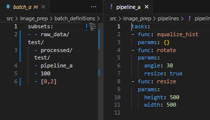
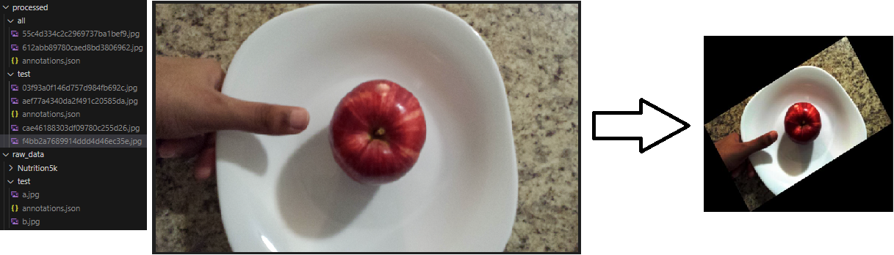

# **Image Preprocessing Container**

### Quickstart

```angular2html
You can cd into the image_prep folder and run it like so:

docker compose run -it image_prep python -m src batch_a
```

## Overview

This container has code that allows you to define data preprocessing pipelines with Luigi, and build batches to increase the size of your image datasets and make them more robust to variations in image quality. 

**Note**: Luigi is a Python package that helps developers schedule and monitor sets of tasks or batch jobs. Developers can specify how these tasks depend on each other using Directed Acyclic Graphs (DAGs), ensuring that tasks are run and retried in the correct order.

(1) `src/image_prep/pipelines`
      - This contains yaml files that define preprocessing pipelines. Check src/image_prep/src/function_registry.py to see which functions are available and their parameters. A preprocessing pipeline is a series of skimage transformations and parameters
      - pipelines are referenced later in batch_definition files which are used to actually run the preprocessing

(2) `src/image_prep/batch_definitions`
      - yaml files here are used to define batches. Ex:
```
subsets:
  - "raw_data/FooDD/Apple/1-Samsung-S4-Light Environment/"
  - processed/FooDD/Apple/
  - pipeline_a
  - 100
  - false
```
      - The parameters are, input directory, output directory, pipeline name, n_images, keep_intermediates
      - n_images chooses a random sample of images, seed is specified in `src/image_prep/src/batch_builder.py`
      - keep_intermediates=true indicates that all intermediate images produced by the pipeline can end up in the batch, keep_intermediates=false indicates that only the final results should be kept
      - alternatively you can pass in a list of indexes here to keep the corresponding outputs from the pipeline

(3) To build a batch of processed images, run `docker compose run image_prep <batch_name>`

(4) For each subset in your batch definition, this will:
      - Run each image in the input folder through the preprocessing pipeline
      - Store the output from each stage in an intermediate directory, using a filename uniquely determined by the original filename and the preprocessing steps.
      - Move images from the intermediate directory to the output directory, determined by keep_intermediates and n_images. If n_images > 0, it will randomly sample up to <n_images>. If n_images=0, it will move all available images to the output directory.
      - Update or create an annotations.json file in the intermediate and output directories which maps all new filenames to their respective labels.

(5) Check the examples in the `src/image_prep/pipelines` and `src/image_prep/batch_definitions` folders for the structure of these yaml files. The ending '/' in the paths is important. This main data directory can be configured, but by default it will look for paths within a `data/` folder at the same level as the main project.

(6) Example:  This image processing pipeline definition



will produce this directory structure and images with the following transformation.


