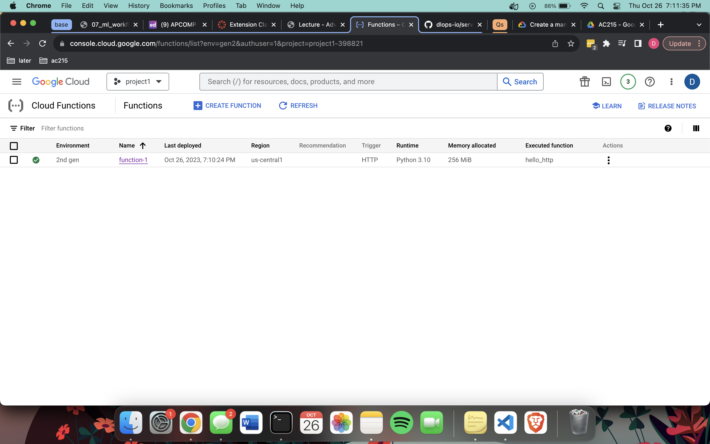
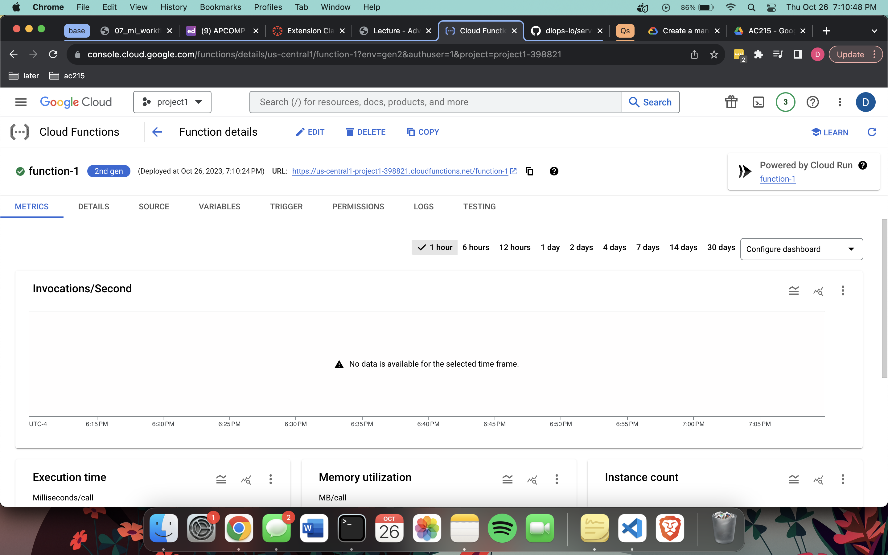
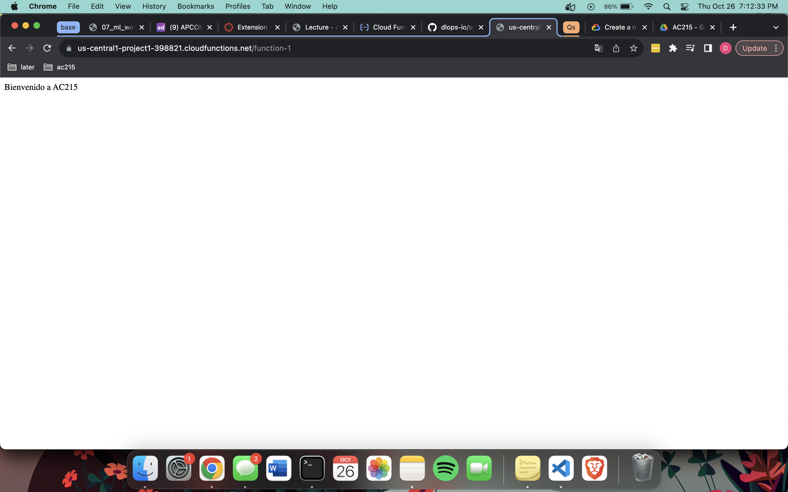
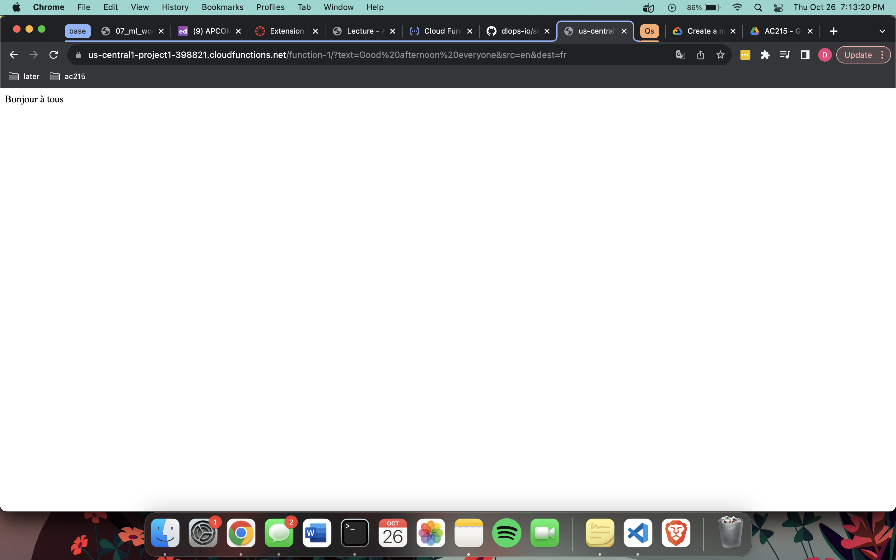
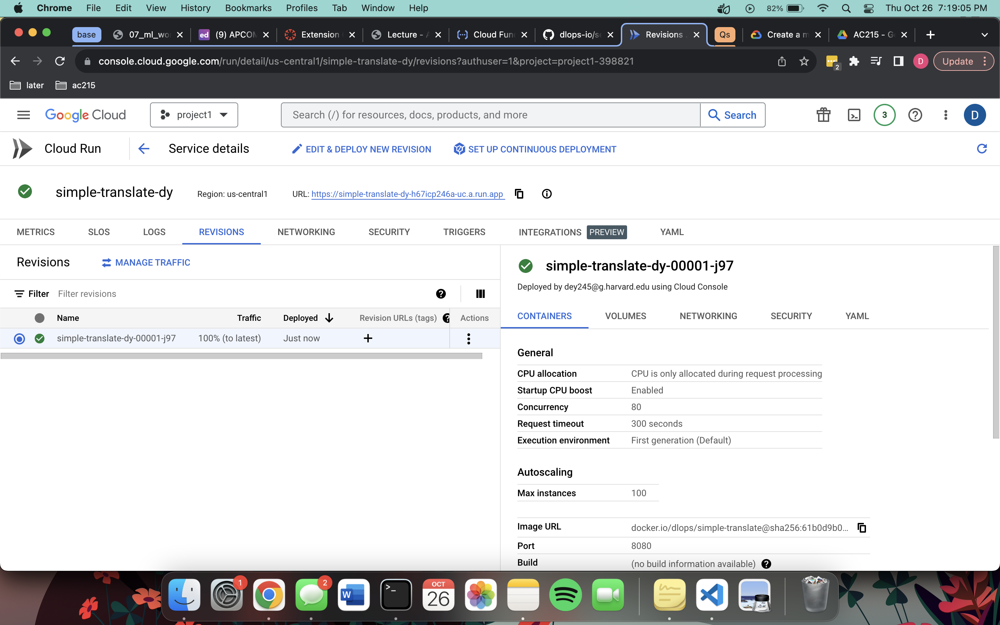
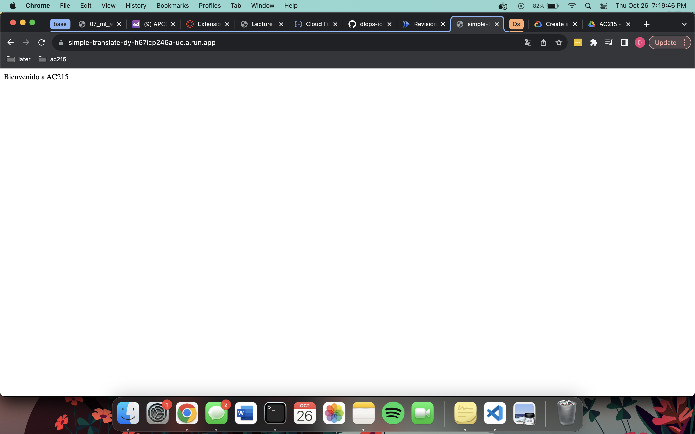

# Overview
The purpose of this cloud functions container is to illustrate how cloud run and cloud functions work.

*Adopted from the following GitHub Repository developed and provided by Shivas Javaram https://github.com/dlops-io/serverless-deployment/*

## Running App as Cloud Function

### Create a Cloud Function
* Screenshots of deployed cloud function "function-1" created using main.py and requirements.py from https://github.com/dlops-io/serverless-deployment/tree/main: 
* 
* 

### Test Cloud Function
* Endpoint URL: https://us-central1-project1-398821.cloudfunctions.net/function-1
* Screenshots of testing our cloud function using different parameters: 
* 
* 

## Running App in Cloud Run

### Setup Cloud Run and Deploy Container
* Image name: dlops/simple-translate:latest
* Service name: simple-translate-dy
* Screenshot of docker image deployed as a cloud run:
* 

### Test Cloud Run
* Endpoint URL: https://simple-translate-dy-h67icp246a-uc.a.run.app
* Screenshots of testing the container within cloud run using different parameters: 
* 
* 

