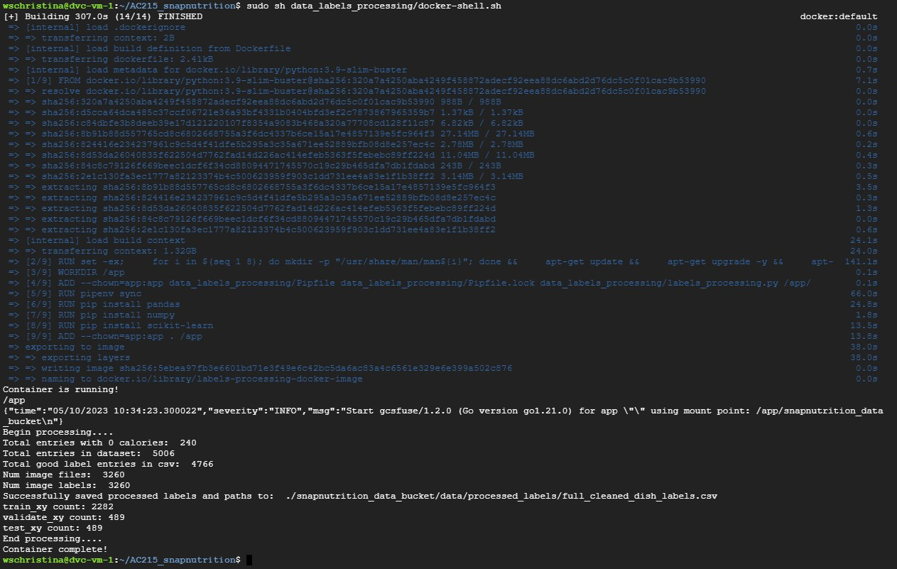
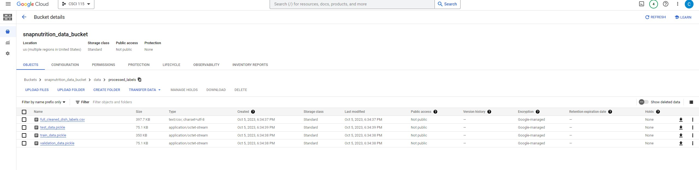

# Overview
The purpose of this data labels processing container is as follows:

1) Have logic to exclude faulty labels (e.g. 0 mass dishes)
2) Create train, test, and validation splits
3) Have the splits be in the format [(label, image_file_path), ...] for easy read in tfrecord creation

The idea is that more labels and more images could be added to our raw dataset with time. Or we could find issues with our data and want to make exclusions. In those cases, we can simply add add our data selection logic here and recreate our train, test, validation splits. 

**Output**: The output will include 

1) One csv which will contain 2 columns:
     - filepaths: string of path to dish image
     - label: array of np.float32 of [total_calories, total_mass, total_fat, total_carb, total_protein]

2) And 3 pickle files for train, test, and validation splits with data in format [(label, image_file_path), ...]


**Purpose:** These outputs can be used to feed into our tfrecords creation container which outputs tfrecords to our Google Bucket.

## Instructions: 

0) Have a Google VM Set-Up with git repo cloned according to the ```data_versioning_control/READEME.md instructions```. This readme is for VM and DVC set-up which should be set-up first so that everything, including the input raw data used to make the splits, can also be versioned or rolled-back. 
1) Within the VM, go to the git repo root folder ```AC215_snapnutrition``` and run: ```sudo sh data_labels_processing/docker-shell.sh```

**Screenshot of a successful run of the command in the Google VM**


3) Output should go to Google Bucket directory specified in the filepath constants at the top of the labels_processing.py script. 
Outputs are as follows: 
-full_cleaned_dish_labels.csv (data before splits)
-train_data.pickle
-test_data.pickle
-validation_data.pickle

**Screenshot of a successful csv and train, test, split pkl outputs on the Google VM**

