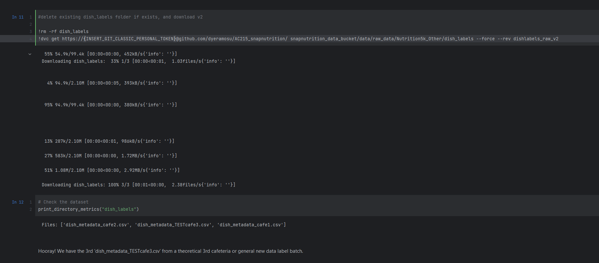

# Container Objective:
- Keep the modeling data on Google Cloud Bucket, use GitHub private repos inside docker container
- Use DVC to version datasets

## Overview of DVC Versioning Flows

Google Cloud Bucket Structure for data and processed data in ```snapnutrition_data_bucket```
```angular2html

├─ data
│  ├─ raw_data
│  │  ├─ Nutrition5k_Other
│  │  └─ Nutrition5k
│  └─ tensorflow_records
│     ├─ 180_by_180
│     └─ New Dataset Pre-Processing Sizes Continued...
└─ dvc_store
```

Basically, we dvc ignore everything, mainly focusing on the following for DVC Versioning: 
```angular2html
data/raw_data/Nutrition5k
data/tensorflow_records/
trainer_package/
models/
```
- The ```data/raw_data/Nutrition5k``` contains the images used for train, validation, and test. These are pre-processed and saved into the corresponding tensorflow_records directory.
- If new images are added into Nutrition5k, they will be fed into making new TF_Record datasets e.g. new dataset with images resized ```to 180_by_180```
- DVC versioning will then track Nutrition5k images and TF_Records datasets.
- ```nutrition5k_v1``` should be the tag for reverting back to the first version of the raw_images_dataset (before tf_record conversion) 
- ```tfrecord_v1``` should be the tag for revreting back to first version of tfrecords
- ```dishlabels_raw_v1``` is the tag for reverting back to raw dish_id label csv's from each data collection source cafeteria (note there is 1 csv per cafeteria compiling the data)

## Quick Commands (Assuming Set-up Complete):
### **Committing New Dataset Versions**

0. There is new data in the bucket already that you want to commit as a new version.

1.  The following commands should run the DVC container and open interactive shell within. 
```
cd ~/AC215_snapnutrition/
sudo sh data_versioning_control/docker-shell.sh
```

2. In the interactive container shell, run the following:

```
gcsfuse --implicit-dirs snapnutrition_data_bucket snapnutrition_data_bucket/
dvc add {DIRECTORY FOR DESIRED VERSIONING, see common dvc adds examples below}  
dvc push

git status
git add .
git commit -m 'dataset updates...'
git tag -a '{VERSION_TAG e.g. dataset_v1}' -m 'tag dataset'
git push --atomic origin {GIT_BRANCH_NAME} '{VERSION_TAG}'
```
Your tag will be how you later retrieve the data version you want. 

#### Common dvc adds Examples:

For versioning after changes to raw images dataset and re-running re-split into train-test-val, and tfrecord recreation 
```angular2html
gcsfuse --implicit-dirs snapnutrition_data_bucket snapnutrition_data_bucket/
dvc add snapnutrition_data_bucket/data/raw_data/Nutrition5k_Other
dvc add snapnutrition_data_bucket/data/raw_data/Nutrition5k
dvc add snapnutrition_data_bucket/data/processed_labels
dvc add snapnutrition_data_bucket/data/tf_records  
dvc push

git status
git add .
git commit -m 'dataset updates...'
git tag -a '{VERSION_TAG e.g. dataset_v1}' -m 'tag dataset'
git push --atomic origin {GIT_BRANCH_NAME} '{VERSION_TAG}'
```

For versioning of new models and train job packaging
```angular2html
gcsfuse --implicit-dirs snapnutrition_data_bucket snapnutrition_data_bucket/
dvc add snapnutrition_data_bucket/models
dvc add snapnutrition_data_bucket/trainer_package
dvc push

git status
git add .
git commit -m 'dataset updates...'
git tag -a '{VERSION_TAG e.g. training_v1}' -m 'tag dataset'
git push --atomic origin {GIT_BRANCH_NAME} '{VERSION_TAG}'
```

#### Screenshot of Succesful Versioning for Data Label CSV's


### **Switching Dataset Versions**

In our set-up, you would most commonly do this outside of the VM. To grab different versions in a local codebase, follow this link: https://dvc.org/doc/command-reference/checkout

Otherwise, look at our [colab notebook](../notebooks/data_versioning_control_demo.ipynb) on a common use case and how to switch versions to download: 

#### Screenshot of notebook downloading version 2 of dish labels and Seeing the Test csv Appear!


Again, full [colab notebook here](../notebooks/data_versioning_control_demo.ipynb)

### Save Model, Output, and/or Dataset Version Dependencies
To checkpoint dependencies (e.g. a saved model and datset version, see detailed instructions from the DVC documentation here: https://dvc.org/doc/use-cases/versioning-data-and-models/tutorial)
We recommend this to ideally be done outside of this Google VM container for a local project clone.

## Initial VM DVC Set-up Steps (Only 1-time):

0) Google cloud bucket with a loaded dataset dish images dataset. Current Bucket:  ```gs://snapnutrition_data_bucket/```
1) Create a GitHub private repo to keep track of dataset versions. Current Repo:  https://github.com/dyeramosu/AC215_snapnutrition
2) Create a VM. Current VM: ```dvc-vm-1``` When you go to the Google console, there should be a web browser SSH option.
3) Install docker within VM terminal

```
# Add Docker's official GPG key:
sudo apt-get update
sudo apt-get install ca-certificates curl gnupg
sudo install -m 0755 -d /etc/apt/keyrings
curl -fsSL https://download.docker.com/linux/debian/gpg | sudo gpg --dearmor -o /etc/apt/keyrings/docker.gpg
sudo chmod a+r /etc/apt/keyrings/docker.gpg

# Add the repository to Apt sources:
echo \
  "deb [arch="$(dpkg --print-architecture)" signed-by=/etc/apt/keyrings/docker.gpg] https://download.docker.com/linux/debian \
  "$(. /etc/os-release && echo "$VERSION_CODENAME")" stable" | \
  sudo tee /etc/apt/sources.list.d/docker.list > /dev/null
sudo apt-get update

sudo apt-get install docker-ce docker-ce-cli containerd.io docker-buildx-plugin docker-compose-plugin -y

sudo docker run hello-world

```
4) Install git within VM terminal
`sudo apt-get install git`

5) Set up git SSH on the VM
  `ssh-keygen -t ed25519 -C "youremail@gmail.com"`  (Press enter for all 3 questions) 
  
Note: Current SSH is `ssh-keygen -t ed25519 -C "wschristina@gmail.com"`

  Your public key is located in `cat /home/<name>/.ssh/id_ed25519.pub` (Copy contents of this file on to clipboard)
  Go to -> GitHub.com -> Settings (top right under your pfp)  -> SSH and GPG keys (left) -> New SSH key -> give any title -> copy contents in key -> Add SSH Key  (please login again when asked)

Note: Current SSH is in ```cat /home/wschristina/.ssh/id_ed25519.pub```. For different user, you may need to generate own git SSH.

6) `git clone git@github.com:dyeramosu/AC215_snapnutrition.git`

7) Upload your ```dvc-secrets.json``` to secrets folder. This secrets folder should be under root of git folder so ```AC215_snapnutrition/secrets/dvc-secrets.json``` Again, when you go to the Google console, there should be a web browser SSH option that also let's you upload files. Check entries in docker-entrypoint.sh, docker-shell.sh

If you do not have a dvc-secrets.json, contact a team member. Otherwise, if this is the very first time set-up follow: 

**Setup GCP Service Account**
- Here are the step to create a service account:
- To setup a service account you will need to go to [GCP Console](https://console.cloud.google.com/home/dashboard), search for  "Service accounts" from the top search box. or go to: "IAM & Admins" > "Service accounts" from the top-left menu and create a new service account called "data-service-account". For "Service account permissions" select "Cloud Storage" > "Storage Admin" (Type "cloud storage" in filter and scroll down till you find). Then click continue and done.
- This will create a service account
- On the right "Actions" column click the vertical ... and select "Manage keys". A prompt for Create private key for "data-service-account" will appear select "JSON" and click create. This will download a Private key json file to your computer. Copy this json file into the **secrets** folder. Rename the json file to `data-service-account.json`


8) Starting within the root folder of the git repo, ```AC215_snapnutrition```, run ```sudo sh data_versioning_control/docker-shell.sh```. This should run the DVC container and open interactive shell within. 

9) Within DVC container interactive shell:
```   
mkdir snapnutrition_data_bucket
gcsfuse snapnutrition_data_bucket snapnutrition_data_bucket/
dvc init
dvc remote add -d snapnutrition_data_bucket gs://snapnutrition_data_bucket/dvc_store
dvc add snapnutrition_data_bucket  
dvc push

git status
git add .
git commit -m 'dataset updates...'
git tag -a 'dataset_v1' -m 'tag dataset'
git push --atomic origin main dataset_v1
```
🎉🎉🎉
You should see tagged dataset on your private repo and also dvc_store on google cloud bucket.
---

