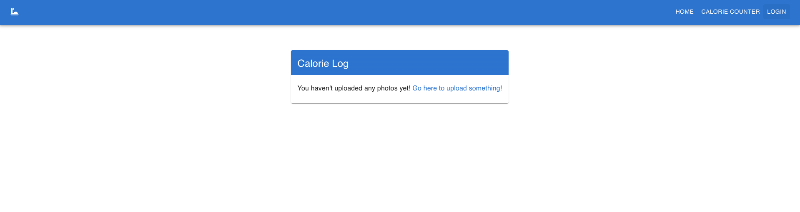
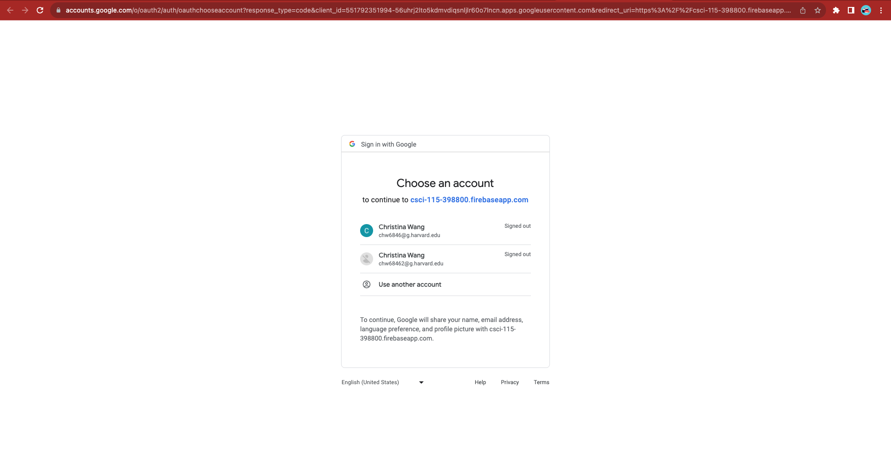
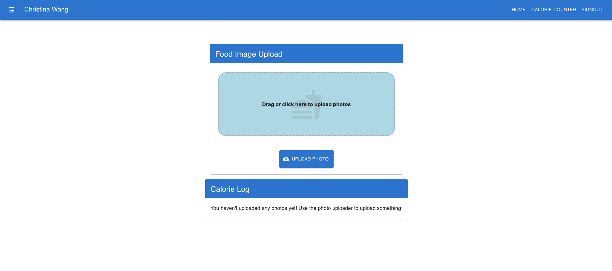
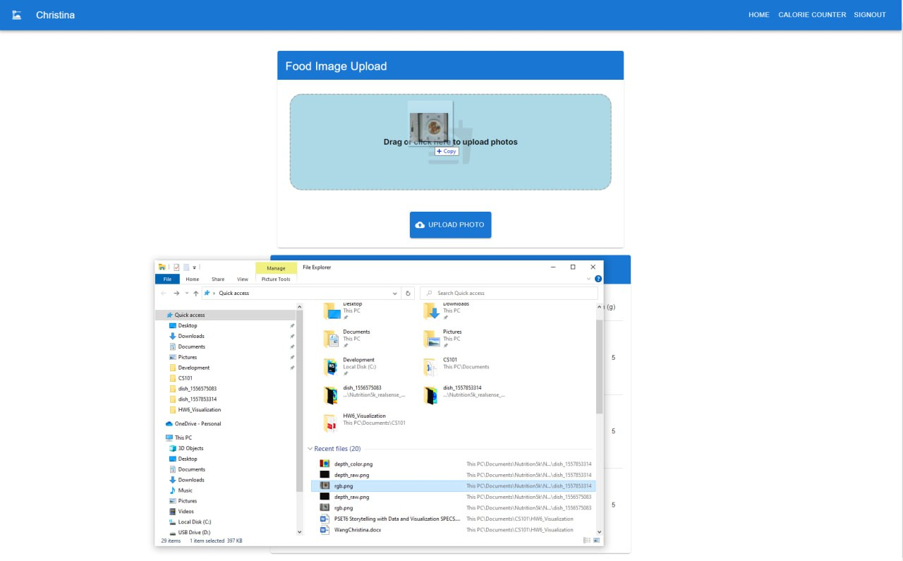
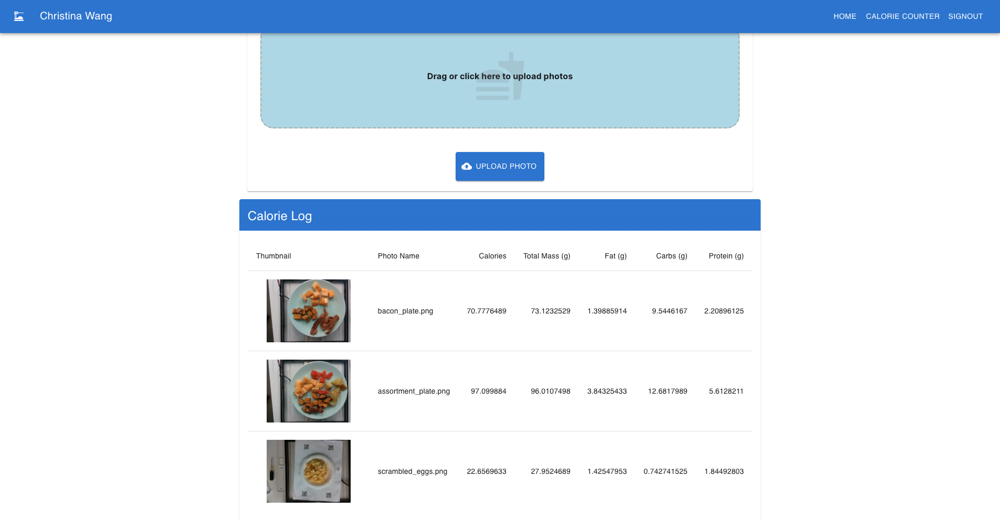
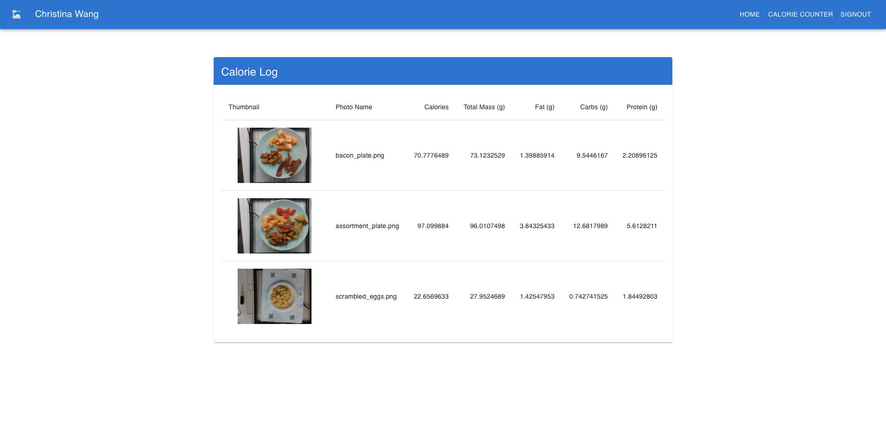
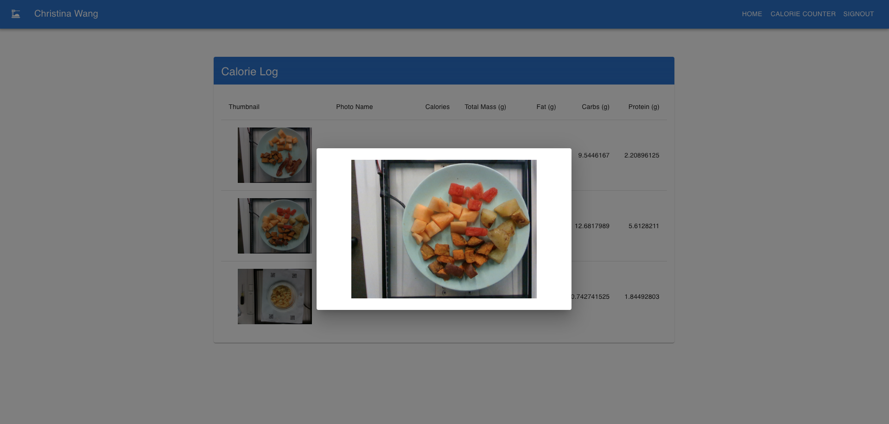

<style>
   li {
       padding-bottom: 10px
   }
</style>

# SnapNutrition Frontend


## Introduction

This frontend is written in Nextjs, which is a react framework that provides a lot of useful, opinionated features that
make it easier to start development quickly. It also includes Google Firebase Authentication for user sign-up and log-in.
This guide is for running the frontend container locally. 
It can also be deployed via Ansible into a Google VM (see other deployment readme)


## Setup
### Prerequisites
You must have Node installed (v20 or higher), either LTS or latest release should be fine for this project, get it here: https://nodejs.org/en/.

It's also highly recommended to install pnpm as it is faster to install packages and easier to fix your project if you 
need to nuke it for whatever reason. After installing Node you can just run the below command:
```shell
npm install -g pnpm
```

### Project Setup

Most of the below steps support either npm or pnpm, so where applicable you will see scripts for both.

1. All dependencies are in the package.json, run one of the below commands in the root directory for the project 
(you should see the folder named "src").
 
    ```shell 
    # NPM
    npm install   
    ```
    ```shell
    # PNPM
    pnpm install
    ```
   ```shell
    # Yarn (reccomended)
    yarn install
    ```
   

2. Running the project is very simple with one of the following commands:
   ```shell
   npm run dev
   ```
   ```shell
   pnpm dev
   ```
   ```shell
   yarn build
   yarn dev
   ```
   ```shell
   yarn build
   yarn start
   ```
   or alternatively (recommended):
   ```shell
   # In terminal
   yarn build
   sh docker-shell.sh
   # Then inside docker container
   yarn start
   ```
   
There are slight differences between yarn dev and yarn start. 
Yarn start runs last build command version only whereas dev may reload on changes.

3. You should now be able to see your project running at http://localhost:3000. 
To terminate the server from command 
press Ctrl + c

#### Screenshots of Successful Frontend

New user and/or not logged in

Once click log-in, you redirect here for Firebase Auth Login

Once you are logged-in, you go to the Calorie Counter tab

You can either click upload or drag files into the dropzone

You will see your results appear below the dropzone as an increasing list

If you go back to the home page, you will see recent uploads and results

You can also click on an image to get a zoomed-in view



### Config
Certain things like endpoints may need to be configured manually. In the case of the snap-nutrition api, you can set the
base url in the [.env.development](./.env.development) file. Normally this file is not included in the repo but for
convenience, it's been included here and contains no sensitive information.


## Firebase Setup (One Time for all developers)
In the absence of having an existing Firebase project, you will need to make your own if you want complete functionality.
1. Go to https://console.firebase.google.com/
2. Follow the steps to create a new project, if you're using GCP it will give you the option to link to a GCP project.
3. Once the project is created, click on the "Project Overview" button.
4. You should see an option towards top, near your project title to "Add app"
5. Select the option for webapp and give it a name.
6. You should get some config text that you can copy into your app. Currently, this is in [Firebase.ts](./src/app/_components/auth/firebase.ts)

## Basic Development Tips And Resources

### Getting Started
This application is built with NextJs, using the latest bootstrapped starter project. NextJS is a react framework, so 
standard react principles apply + NextJs' opinionated approach. You'll need to follow their tutorials for a more in-depth
guide but here's a few things to keep in mind to help understand:

1. Folder and file names have importance, for example the underscore in _components causes next to not consider any
content inside said folder as a route. On the other hand, standard folders with a page.tsx file will be treated as routes.
So calorie-counter becomes a route you can and will visit in the url, ie: http://localhost:3000/calorie-counter. 

2. More Next info can be found here, take note we are using the app router: https://nextjs.org/docs

3. This is not a part of Next, but global state is currently being done with Redux Toolkit (RTK), queries with RTK Query
which is a part of the same package. It's highly recommend to understand the basics behind RTK before making changes to 
any "store" logic. More info here: https://redux-toolkit.js.org/introduction/getting-started

4. Nearly all visual components are using the MUI framework, so attributes and configuration for those should be based 
on their component API. More info here: https://mui.com/material-ui/getting-started/