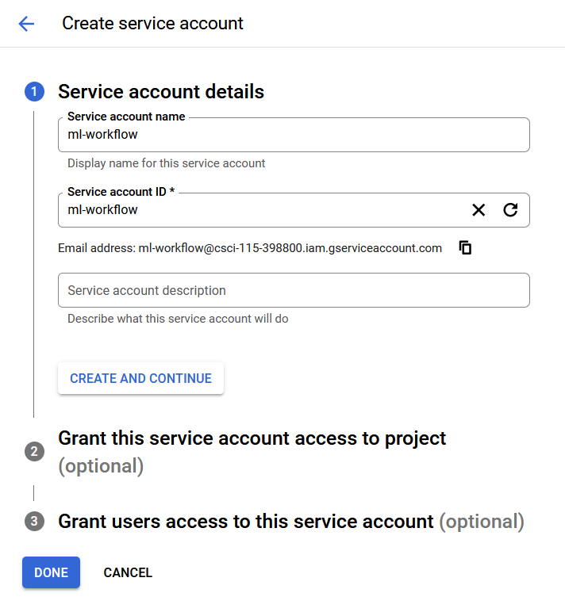
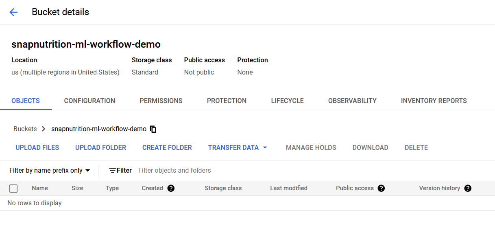
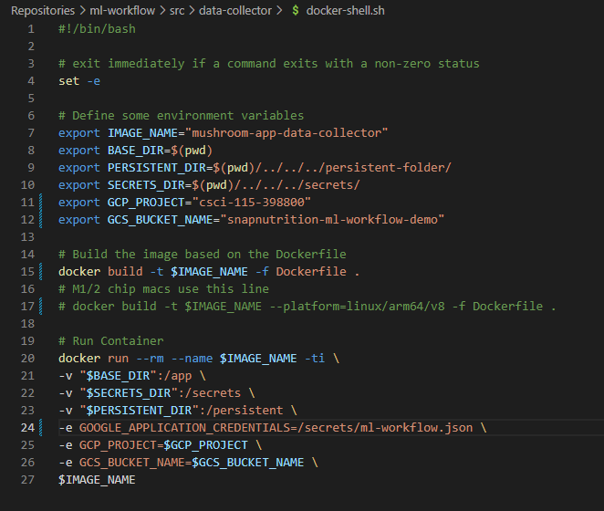
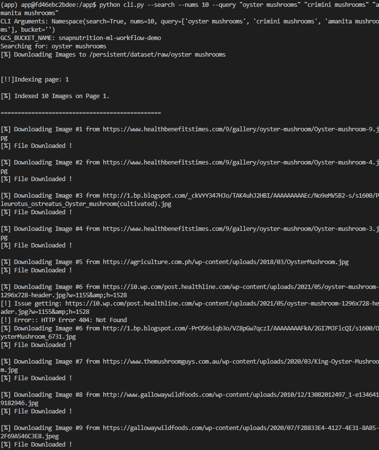
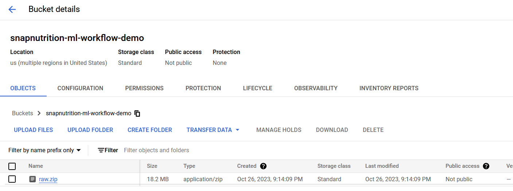
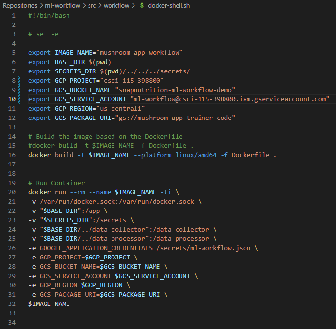
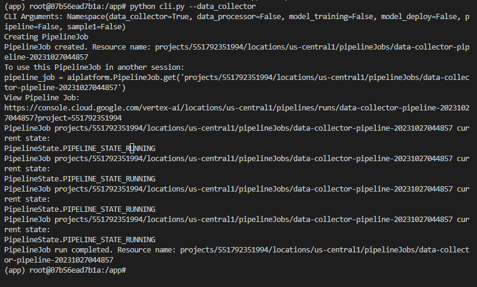
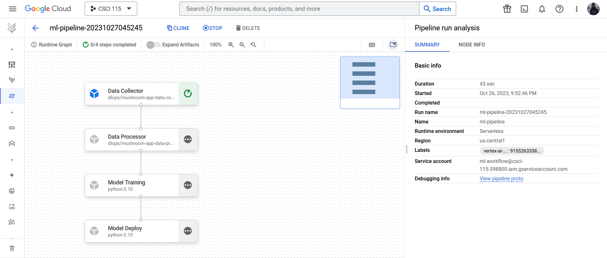

# Overview
The purpose of this folder is to demonstrate the ml workflow tutorial presented in class. This tutorial teaches some basics of Kubeflow and Vertex AI Pipelines. 

*Adopted from the following GitHub Repository developed and provided by Shivas Javaram https://github.com/dlops-io/ml-workflow/*

## Setup Environments

### Create a Service Account
* Screenshot of creating the service account called `ml-workflow`: 

### Create Bucket
* Screenshot of creating the storage bucket `snapnutrition-ml-workflow-demo`

## Data Collector Container

### Edit Data Collector Docker Shell Script
* Screenshot of tailored shell script: 

### Build Data Collector Docker Container
* Screenshot of completed data collection:

* Screenshot of raw zip file uploaded to bucket:

## Running Workflow Pipeline

### Edit Workflow Docker Shell Script
* Screenshot of tailored shell script: 

### Run Data Collector Pipeline
* Screenshot of running data collection pipeline:

* Screenshot of running workflow pipeline:

