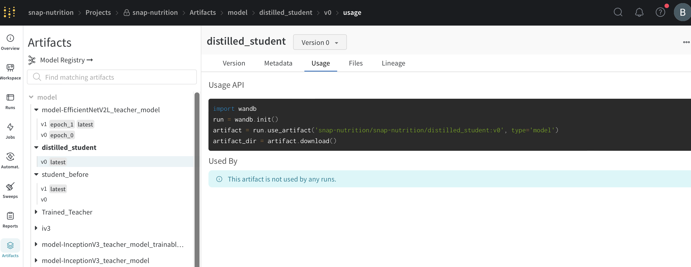
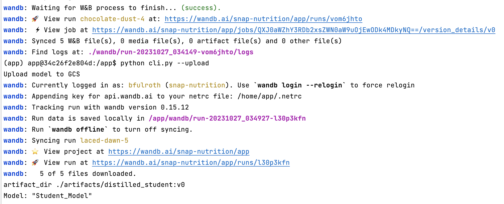
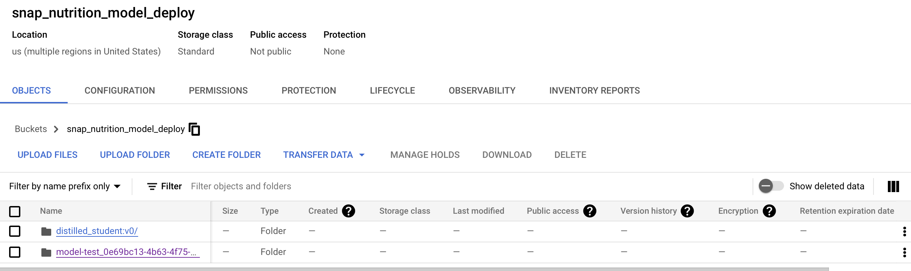
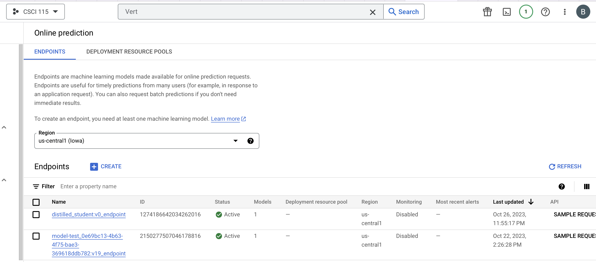
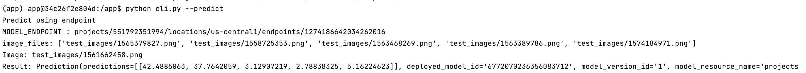

# Model Deployment Container
## Overview
The purpose of this model-training container is as follows:

1. Download best model from Weights and Biases.
2. Change the models signature so that images that are feed into the model during inference are preprocessed.
3. Upload the model to Vertex AI Model Registry.
4. Deploy the model to Vertex AI and create an endpoint for prediction requests.

## Prerequisites
* Have Vertex AI serverless training setup.
* Have Weights and Biases setup to track training jobs.
* Have Docker installed
* Check that your Docker is running with the following command

`docker run hello-world`

### Install Docker 
Install `Docker Desktop`

#### Ensure Docker Memory
- To make sure we can run multiple container go to Docker>Preferences>Resources and in "Memory" make sure you have selected > 4GB

#### Similar to other containers in this project ensure there is a **secrets** folder

It is important to note that we do not want any secure information in Git. So we will manage these files outside of the git folder. At the same level as the `model-deployment` folder create a folder called **secrets**

Your folder structure should look like this:
```
   |-model-deployment
   |-secrets
```

#### Setup GCP Service Account
- Here are the step to create a service account:
- To setup a service account you will need to go to [GCP Console](https://console.cloud.google.com/home/dashboard), search for  "Service accounts" from the top search box. or go to: "IAM & Admins" > "Service accounts" from the top-left menu and create a new service account called "model-deployment". For "Service account permissions" select "Storage Admin", "AI Platform Admin", "Vertex AI Administrator".
- This will create a service account
- On the right "Actions" column click the vertical ... and select "Manage keys". A prompt for Create private key for "model-deployment" will appear select "JSON" and click create. This will download a Private key json file to your computer. Copy this json file into the **secrets** folder. Rename the json file to `model-deployment.json`

### Create GCS Bucket

We need a bucket to store the saved model files that we will be used by Vertext AI to deploy models.

- Go to `https://console.cloud.google.com/storage/browser`
- Create a bucket `snap_nutrition_model_deploy`

## Run Container

#### Run `docker-shell.sh` or `docker-shell.bat`
Based on your OS, run the startup script to make building & running the container easy

This is what your `docker-shell` file will look like:
```
#!/bin/bash

set -e

export IMAGE_NAME=model-deployment-cli
export BASE_DIR=$(pwd)
export SECRETS_DIR=$(pwd)/../secrets/
export GCP_PROJECT="csci-115-398800"
export GCS_MODELS_BUCKET_NAME="snap_nutrition_model_deploy"

# Build the image based on the Dockerfile
#docker build -t $IMAGE_NAME -f Dockerfile .
# M1/2 chip macs use this line
docker build -t $IMAGE_NAME --platform=linux/arm64/v8 -f Dockerfile .

# Run Container
docker run --rm --name $IMAGE_NAME -ti \
-v "$BASE_DIR":/app \
-v "$SECRETS_DIR":/secrets \
-e GOOGLE_APPLICATION_CREDENTIALS=/secrets/model-deployment.json \
-e GCP_PROJECT=$GCP_PROJECT \
-e GCS_MODELS_BUCKET_NAME=$GCS_MODELS_BUCKET_NAME \
$IMAGE_NAME
```

- Make sure you are inside the `model-deployment` folder and open a terminal at this location
- Run `sh docker-shell.sh` or `docker-shell.bat` for windows

Add Weight and Biases API Key to your environment variables.

`export WANDB_KEY=...`

### Prepare Model for Deployment
We have our model weights stored in WandB after we performed serverless training. In this step we will download the model and upload it to a GCS bucket so Vertex AI can have access to it to deploy to an endpoint.

* Run `python cli.py --upload`, this will download the model weights from WandB and upload to the specified bucket in `GCS_MODELS_BUCKET_NAME`

### Upload & Deploy Model to Vertex AI
In this step we first upload our model to Vertex AI Model registry. Then we deploy the model as an endpoint in Vertex AI Online prediction.

* Run `python cli.py --deploy`, this option will both upload and deploy model to Vertex AI
* This will take a few minutes to complete
* Once the model has been deployed the endpoint will be displayed. The endpoint will be similar to: `projects/129349313346/locations/us-central1/endpoints/5072058134046965760`

### Test Predictions

* Update the endpoint uri in `cli.py`
* Run `python cli.py --predict`
* You  should see results similar to this:
```
Image: test_images/1565379827.png
Result: Prediction(predictions=[[76.3800049, 68.4668503, 2.39028168, 6.54596376, 5.12592745]], deployed_model_id='6772070236356083712', model_version_id='1', model_resource_name='projects/551792351994/locations/us-central1/models/6840745732626972672', explanations=None)
[76.3800049, 68.4668503, 2.39028168, 6.54596376, 5.12592745]

```
Take note that the numbers in the array are the predictions for calories, total mass (g), fat (g), carbs (g), protein (g) respectively.

## Example of a Successful Deployment

__Our Best Model: Student Distilled Logged on Weights and Biases__


__Sucecssful Download from Weight and Biases, Signature Change, and Upload to GCS__



__Showing Saved Model in GCS__



__Showing Successful Model Deployment and Inference Endpoint__


__Showing Successful Model Endpoint Creation__



__Showing Successful Inference__

