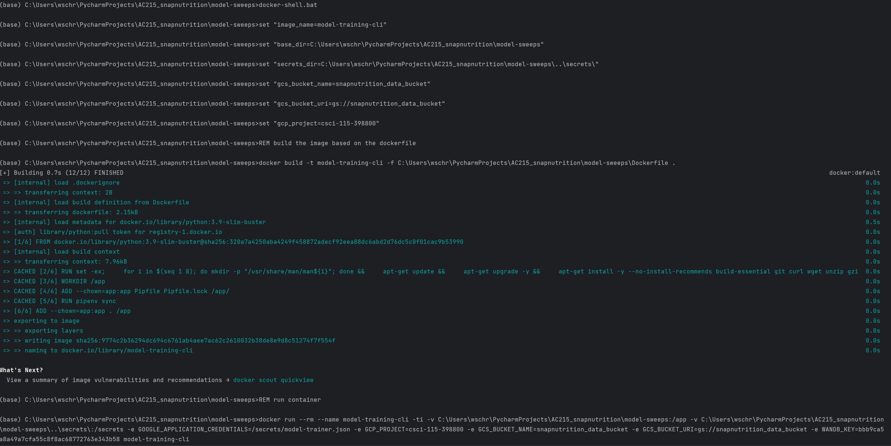
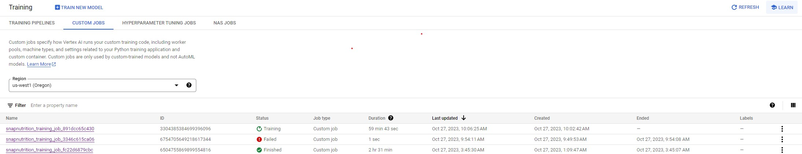
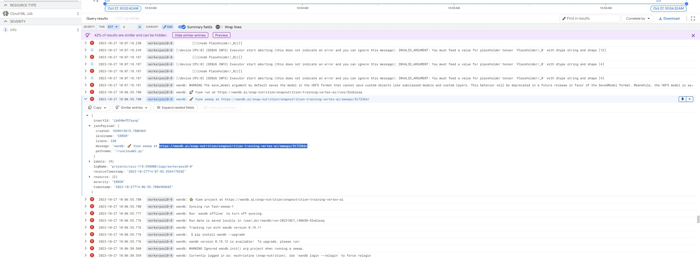
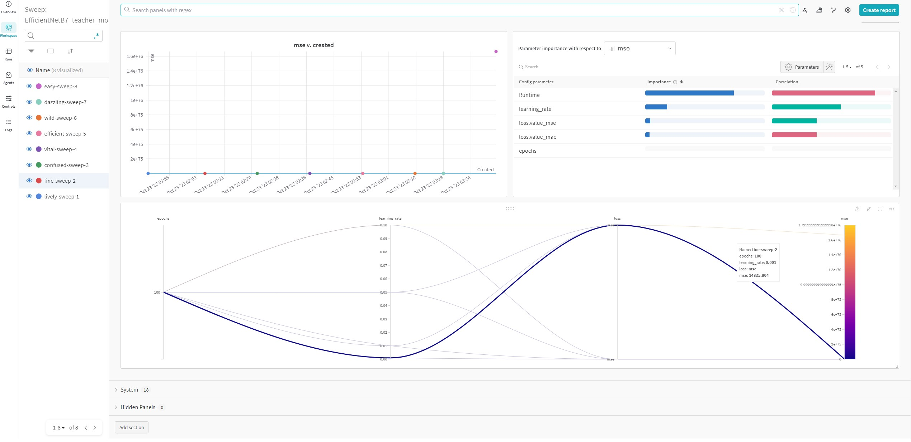

# Overview
The purpose of this model-sweeps container is as follows:

1. Conduct grid-search of hyperparams using WB Sweeps, unlike the related model-training container
    - Note: The model-training container is more for playing with individual transfer learning architecture and fine-tuning.
2. Scale and parameterize our model sweeps by using serverless training on Google's Vertex AI platform.
2. Automatically track model sweeps using the Weights and Biases platform.
3. Automatically save trained models to a google cloud bucket for ease of model selection and inference.

## Dependencies

This container depends on our `image_prep` container and our `tfrecords_creation` containers.  Our `image_prep` container process raw images from the Nutrition 5K dataset and our `tfrecords_creation` container creates TensorFlow Datasets, stores them in a Google Cloud Bucket, and also versions these records using Data Version Control [dvc](dvc.org).  See the tfrecord_creation container README.md for a more detailed description.  This container uses these TensorFlow Datasets to efficiently train our models.

## Instructions:

*Adopted from the following GitHub Repository developed and provided by Shivas Javaram [https://github.com/dlops-io/model-training](https://github.com/dlops-io/model-training)*

### Setup GCP Credentials

Enable this container to have access to Storage buckets & Vertex AI(AI Platform) in GCP. 

#### Create a local **secrets** folder

It is important to note that we do not want any secure information in Git. So we will manage these files outside of the git folder. 

Folder Structure:
```
   |-model-sweeps
   |-secrets
```

#### Setup GCP Service Account

- Go to [GCP Console](https://console.cloud.google.com/home/dashboard), search for  "Service accounts" from the top search box. or go to: "IAM & Admins" > "Service accounts" from the top-left menu and create a new service account called "model-trainer". For "Service account permissions" select "Storage Admin", "AI Platform Admin", "Vertex AI Administrator".
- This will create a service account.
- On the right "Actions" column click the vertical ... and select "Manage keys". A prompt for Create private key for "model-trainer" will appear select "JSON" and click create. This will download a Private key json file to your computer. Copy this json file into the **secrets** folder. Rename the json file to `model-trainer.json`

### Create GCS Bucket

We need a bucket to store the packaged python files that we will use for training.

- Go to `https://console.cloud.google.com/storage/browser`
- Create a bucket `snapnutrition_data_bucket`

### Get WandB Account API Key

We want to track our model training runs using WandB. Get the API Key for WandB: 
- Login into [WandB](https://wandb.ai/home)
- Go to to [User settings](https://wandb.ai/settings)
- Scroll down to the `API keys` sections 
- Copy the key
- Set an environment variable using your terminal: `export WANDB_KEY=...` 
- Note: For Windows, set environment variable using Command Terminal `set WANDB_KEY=...`

### Review Build Files 

- Open & Review `model-sweeps` > `package` > `setup.py`. All required third party libraries needed for training are specified in `setup.py`. 
- Open & Review `model-sweeps` > `package` > `trainer` > `task.py`. All training code for the snap-nutrition app models are present in `task.py`
     * Note: This file contains a WANDB sweep config of hyperparms to grid search over.
- Open & Review `model-sweeps` > `package` > `trainer` > `model_config.yml`. The package will create a model according to the specs in this file. Change it before launching the container.
     * Note: Some params will be overriden by grid search sweep in task.py. Edit/Review task.py sweep config to change.
- Open & Review `model-sweeps` > `cli.sh`. Change these files before launching the Docker container. Comment or uncomment lines as necessary within `cli.sh` when using GPUs or not. Ensure the appropriate region, accelerators, bucket name, project name, TFrecords folder, and model upload folders are correct.  

### Run Container

#### Run `sh docker-shell.sh` or `docker-shell.bat`
Based on your OS, run the startup script to make building & running the container easy

This is what your `docker-shell` file will look like:
```
export IMAGE_NAME=model-training-cli
export BASE_DIR=$(pwd)
export SECRETS_DIR=$(pwd)/../secrets/
export GCS_BUCKET_URI="gs://snapnutrition_data_bucket" 
export GCP_PROJECT="csci-115-398800"


# Build the image based on the Dockerfile
docker build -t $IMAGE_NAME -f Dockerfile .
# M1/2 chip macs use this line
#docker build -t $IMAGE_NAME --platform=linux/arm64/v8 -f Dockerfile .

# Run Container
docker run --rm --name $IMAGE_NAME -ti \
-v "$BASE_DIR":/app \
-v "$SECRETS_DIR":/secrets \
-e GOOGLE_APPLICATION_CREDENTIALS=/secrets/model-trainer.json \
-e GCP_PROJECT=$GCP_PROJECT \
-e GCS_BUCKET_URI=$GCS_BUCKET_URI \
-e WANDB_KEY=$WANDB_KEY \ [MAKE SURE YOU HAVE THIS VARIABLE SET]
$IMAGE_NAME
```

- Make sure you are inside the `model-sweeps` folder and open a terminal at this location
- Run `sh docker-shell.sh` or `docker-shell.bat` for windows
- The `docker-shell` file assumes you have the `WANDB_KEY` as an environment variable and is passed into the container


### Run Package Creation Script

#### Run `sh package-trainer.sh`
- This script will create a `trainer.tar.gz` file with all the training code bundled inside it
- Then this script will upload the packaged file to your GCS bucket and call it `snapnutrition-trainer.tar.gz`

### Create Jobs in Vertex AI

#### Run `sh cli.sh`
- Open & Review `model-training` > `cli.sh`
- `cli.sh` is a script file to make calling `gcloud ai custom-jobs create` easier by maintaining all the parameters in the script
- Make any required changes to your `cli.sh`.
- List of `ACCELERATOR_TYPE` are:
    - NVIDIA_TESLA_T4
    - NVIDIA_TESLA_K80
    - NVIDIA_TESLA_P100
    - NVIDIA_TESLA_P4
    - NVIDIA_TESLA_A100
    - NVIDIA_TESLA_V100
- List of some `GCP_REGION` are:
    - us-central1
    - us-east1
    - us-east4
    - us-south1
    - us-west1
    - ...

#### OPTIONAL: Create Jobs in Vertex AI using CPU
- Uncomment and comment the appropriate lines in `cli.sh`
- Run `sh cli.sh`

### View Jobs in Vertex AI
- Go to Vertex AI [Custom Jobs](https://console.cloud.google.com/vertex-ai/training/custom-jobs)
- You will see the newly created job ready to be provisioned to run. 

### View Training Metrics
- Go to [WandB](https://wandb.a)
- Select the project `snap-nutrition`
- You will view the training metrics tracked and automatically updated

## Examples of a Successful Training Run

### Screenshots of a successful training run of multiple models with different parameters on Vertex AI

- Note: Some terminal output not shown which shows the WANDB_KEY



### Screenshots of model Sweeps being sucessfully tracked using Weights and Biases





