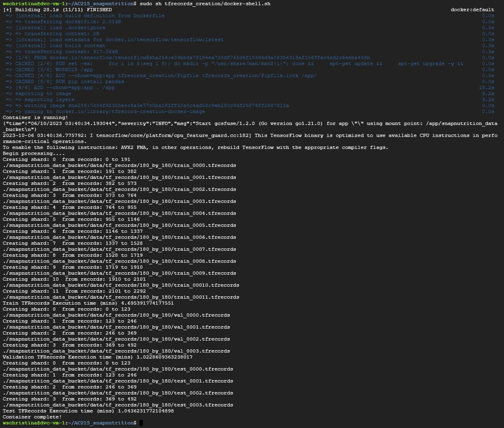
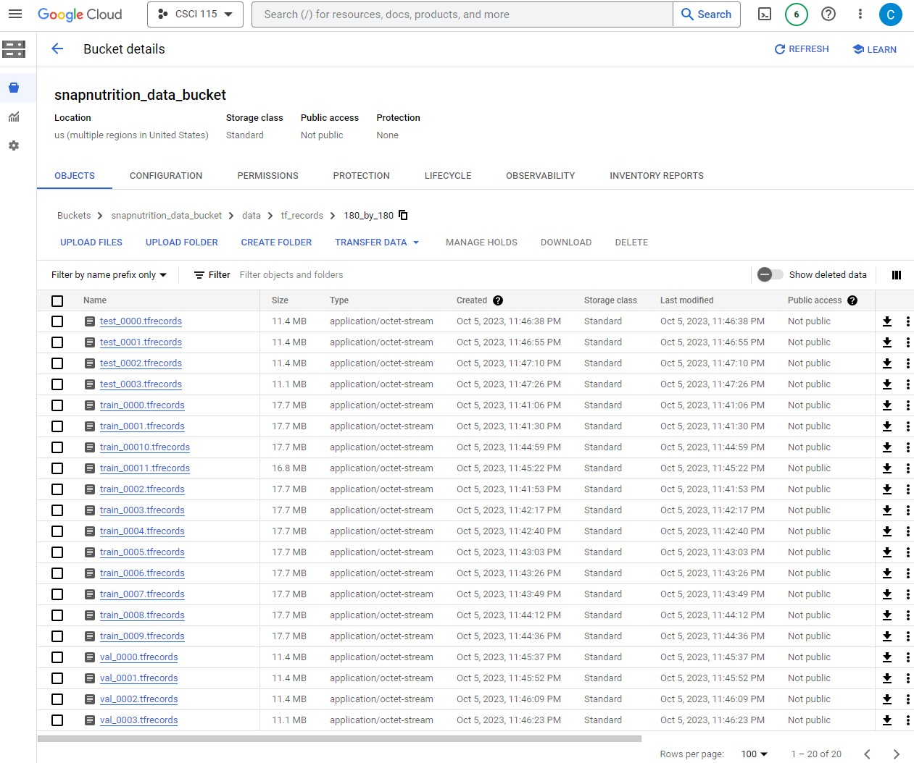

# Overview
The purpose of this tfrecords container is as follows:

1) Have logic to create tfrecords from our train, test, validation pickle files which contain both images filepaths and corresponding labels. These pickle files are the output from the ```data_labels_processing``` directory container of this repo.
2) Pre-process images e.g. resize, rescale before saving as tf record (variables defined at the top of ```tfrecords_creation.py```)
2) Save these tfrecords into our Google Cloud Storage Bucket for ingestion by downstream data training services

**Purpose:** These tfrecords allow optimized training data ingestion for our downstream model training services. Remember tfrecords will change with any changes to the raw image&label data and data splits. Therefore, dvc is and should be used to version raw-data dependencies in addition to the tfrecords themselves.


## Instructions: 

0) Have a Google VM Set-Up with git repo cloned according to the ```data_versioning_control/READEME.md instructions```. This readme is for VM and DVC set-up which should be set-up first so that everything, including the input data splits, can also be versioned or rolled-back. 
1) Within the VM, go to the git repo root folder ```AC215_snapnutrition``` and run: ```sudo sh tfrecords_creation/docker-shell.sh```

**Screenshot of a successful run of the command in the Google VM**


3) Outputs from the container run should go to Google Bucket directory specified in the filepath constants at the top of the tfrecords_creation.py script.

**Screenshot of a successful tfrecords outputs on the Google VM corresponding to train, validation, and test splits**



